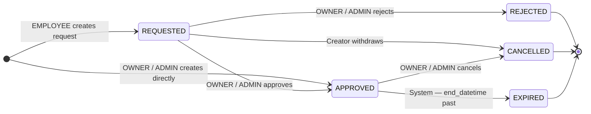

# ADR-002 — BlockedSlot State Machine

**Status:** Accepted  
**Date:** 2026-04-28  
**Domain:** schedule  
**Editorial:** ADVANCED

> **Engineering Question Answered:** When an employee can request a block on their own availability but that block directly affects booking capacity for the business, how do you prevent self-approval while keeping the workflow explicit, auditable, and impossible to bypass by accident?

---

## Problem

The initial `BlockedSlot` implementation used a flat-row model: any authorised actor could create a blocked slot, and that slot was immediately effective — visible to calendar queries and capable of blocking bookings. For an owner creating a business-wide block, this is correct behaviour. For an employee blocking their own availability without any owner review, it is not: an employee who can self-declare days off without an approval gate has effectively granted themselves a unilateral scheduling power that the business has not endorsed.

The flat-row model also carried no state: there was no way to represent "pending approval", no way to record a rejection reason, and no way to distinguish an active block from one that had been rescinded. The entity was either present or absent.

## Context

The existing model created three distinct governance problems:

**No approval gate for employee-initiated blocks.** An employee blocking their own availability with immediate effect bypasses the owner's ability to review and reject requests that are operationally inconvenient. In a multi-employee service business — where schedule gaps affect revenue and customer experience — this is a material control failure.

**No explicit state machine.** Without states, the system cannot enforce deterministic transitions. Adding temporal logic (an expired block, a withdrawn request) requires ad-hoc conditional checks scattered through the service layer rather than a validated transition graph.

**No audit trail for block decisions.** There was no record of who approved a block, who rejected one, or what reason was given. Approval and rejection decisions carry operational significance and should be auditable.

The product team confirmed that an approval workflow is the desired behaviour: owners need visibility and veto over employee schedule requests before they affect bookings.

## Decision

`BlockedSlot` has an explicit five-state machine. State is stored as a column on the entity. Only one state affects calendar availability.

### State semantics

| State | Meaning | Affects calendar? | Mutable? |
|---|---|---|---|
| `REQUESTED` | Employee has submitted a block request; awaiting owner review | No | Creator can edit or cancel |
| `APPROVED` | Owner has approved; block is effective | **Yes** — the only state that blocks bookings | Read-only (must transition to CANCELLED to remove) |
| `REJECTED` | Owner denied the request | No | Read-only — terminal |
| `CANCELLED` | Approved block was cancelled by the owner, or a pending request was withdrawn by its creator | No | Read-only — terminal |
| `EXPIRED` | `end_datetime` has passed and the block was `APPROVED` — historical record of a completed block period | No | Read-only — terminal |

### Transition rules

| From | To | Who can trigger |
|---|---|---|
| (creation) → `REQUESTED` | EMPLOYEE creating their own block request | EMPLOYEE only — self-approval is never permitted |
| (creation) → `APPROVED` | OWNER / ADMIN creating a block directly (any employee, or business-wide) | OWNER / ADMIN — direct creation preserves existing owner behaviour |
| `REQUESTED` → `APPROVED` | OWNER / ADMIN approves the request | Approval action with optional note |
| `REQUESTED` → `REJECTED` | OWNER / ADMIN rejects the request | Rejection requires a reason (written to `rejection_reason`) |
| `REQUESTED` → `CANCELLED` | Original creator withdraws their own pending request | Creator only — before any owner action |
| `APPROVED` → `CANCELLED` | Owner or original creator removes an active block | OWNER / ADMIN always; EMPLOYEE only for their own blocks |
| `APPROVED` → `EXPIRED` | System-initiated — end_datetime has passed | Scheduled job; no human actor |

Any transition not in this table is rejected by the service layer. Default-deny: if a transition is not explicitly listed, it is illegal.

### Calendar query contract

The single most important invariant of this state machine: **only `APPROVED` blocks affect booking availability**. Calendar overlap queries (`findOverlapping*`) filter `WHERE status = 'APPROVED'`.

`REQUESTED` blocks are visible only to:
- The original creator (their own pending request)
- OWNER / ADMIN (the approval queue)

A pending request that has not been approved does not constrain any booking.

### Expiry and the temporal boundary

The `EXPIRED` transition connects this decision to ADR-011 (Appointment Temporal Boundary). When `end_datetime` passes, a scheduled job transitions `APPROVED` blocks to `EXPIRED`. The `EXPIRED` state is a derived consequence of the temporal boundary — the same principle that governs appointment state after `appointment.datetime` applies here: a block whose end time has passed is no longer operational. The `BlockedSlot` precedent for timestamp-driven state transitions — from a flat-row model with no states to an explicit FSM — directly motivated the generalisation of the temporal boundary principle in ADR-011.

### Notifications

State transitions generate notifications to the relevant parties:

- `REQUESTED` created by EMPLOYEE → notify OWNER / ADMIN (block request pending approval)
- `REQUESTED` → `APPROVED` → notify the affected employee (request approved)
- `REQUESTED` → `REJECTED` → notify the affected employee (request rejected; reason included)
- `APPROVED` → `CANCELLED` → notify the affected employee (active block removed)

Notifications are dispatched by a domain event listener after the state transition commits, consistent with the notification architecture used elsewhere in the system.

## Rationale

**Restores owner authority over schedule.** An employee requesting a block with immediate effect is an uncontrolled write to the business's booking availability. The approval gate gives the owner visibility and veto before the request affects operations.

**Backwards compatibility.** Blocks created before the state machine was introduced were created directly by OWNER / ADMIN and were immediately effective. The data migration treats all pre-existing blocks as `APPROVED`, reflecting the de-facto state they were in.

**Owner experience unchanged.** When an OWNER creates a block, it goes directly to `APPROVED`. The approval workflow is an additional step for EMPLOYEE-initiated requests only — not a bureaucratic layer on top of the existing owner UX.

**Five states, no more.** The five prescribed states cover the full lifecycle without over-engineering. A `PENDING_ESCALATION` state, a `DISPUTED` state, and similar additions were considered and rejected as premature. The current five states are exactly what the operational requirements need.

**Auditable by design.** Every state transition is a first-class event. Combined with the Layer 3 audit log established in ADR-003, every approval and rejection has an actor, a timestamp, and a reason.

## Consequences

### Positive

- EMPLOYEE-initiated blocks do not affect calendar availability until an owner reviews and approves them.
- The approval queue gives the owner a clear and actionable "what's pending" surface.
- Rejection reasons are documented; employees receive feedback on denied requests.
- Every block decision is auditable: who approved or rejected it, when, and with what reasoning.
- The state machine is the enforcement mechanism — not a permission check that can be bypassed.

### Negative

- Employee-initiated blocks are no longer instant; they require owner action before becoming effective. In a business where the owner is rarely available, pending requests can accumulate.
- The approval queue is a new UI surface for owners. Its design affects how much friction the workflow adds to the owner's day-to-day.
- The migration from the flat-row model requires a schema change, a data migration for existing rows, and updates to all repository queries that assume flat availability.

### Neutral

- A `requireBlockApproval` settings toggle — allowing owners to disable the approval workflow for trusted employees — was explicitly rejected. A setting that disables the approval gate re-introduces the governance problem at the moment it is activated. If a "trust mode" for solo-owner businesses is needed in the future, it should be a new ADR that specifies the invariants it preserves, not a flag that silently removes them.
- Auto-approval after N hours without owner action was considered as a mitigation for the accumulation problem. It is deferred to a future ADR. The state machine does not preclude it; it prevents it from being added implicitly.

## Alternatives Considered

| Option | Why Rejected |
|---|---|
| Flat-row model (status quo) | No approval gate for EMPLOYEE-initiated blocks; no state history; no audit trail. An employee can unilaterally affect booking availability. |
| `requireBlockApproval` settings toggle | A toggle that disables the approval workflow re-introduces the governance violation when activated. Settings can refine policy; they cannot bypass load-bearing governance constraints. |
| Soft state via permission checks (no schema change) | Moving the workflow into permission logic instead of an explicit state is exactly the "implicit state machine" pattern that makes systems hard to reason about. Explicit state machines are auditable; permission checks distributed across service methods are not. |

## Engineering Principle

An entity that carries a multi-step workflow — request, review, approve or reject — needs an explicit state machine, not an implicit one. An implicit state machine is one where the "state" is inferred from a combination of fields, permission checks, and conditional logic scattered across service methods. An explicit state machine stores its current state, defines its legal transitions in one place, and enforces them at a single validation point. The explicit form is auditable: every transition is a discrete event with an actor, a timestamp, and a reason. The implicit form is not: the current state has to be reconstructed from field values, and the history cannot be reconstructed at all. When the operational consequence of a state — in this case, whether an entire period of business availability is blocked — is significant, the state must be explicit.

## Related

- [ADR-003](./ADR-003-hybrid-audit-strategy.md) — BlockedSlot state transitions (APPROVED, REJECTED, CANCELLED) are Layer 3 audit events; named audit columns on `blocked_slots` are the Layer 2 complement
- [ADR-011](./ADR-011-appointment-temporal-boundary.md) — the EXPIRED transition is governed by the temporal boundary principle; `BlockedSlot.end_datetime` plays the same role as `appointment.datetime` — when it passes, the operational phase ends
- [Governance: state-machines.md](../governance/state-machines.md) — canonical FSM definitions and transition tables for all lifecycle entities *(planned)*
- [Governance: permissions.md](../governance/permissions.md) — which roles can trigger each transition and under what conditions *(planned)*

## Source Code Reference

*Populated when source code is present (v0.3.0+).*

- `BlockedSlotStatus.java` — the five-state enum; maps to the `status` column
- `BlockedSlotService.validateBlockedSlotTransition()` — the single transition validation point; rejects any transition not in the table above
- `BlockedSlotService.approve()` / `reject()` / `cancel()` — the three owner-triggered transitions; each writes the actor and timestamp to the corresponding named columns
- `BlockedSlotRepository.findOverlapping*` — all overlap queries filter `WHERE status = 'APPROVED'`; this invariant is enforced here, not in service logic
- `expireApprovedBlocksJob()` — scheduled job; transitions `APPROVED` → `EXPIRED` for all blocks where `end_datetime < now()`
- `BlockedSlotEventListener.java` — dispatches notifications and writes Layer 3 audit entries after each state transition