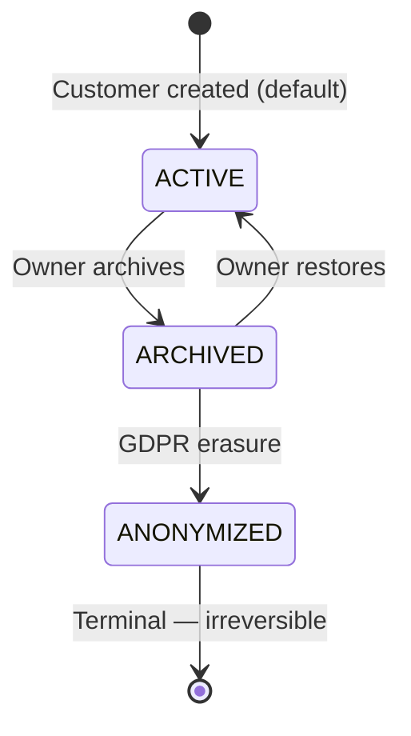

# ADR-004 — Customer Lifecycle States

**Status:** Proposed  
**Date:** 2026-04-28  
**Domain:** customer  
**Editorial:** ADVANCED

> **Engineering Question Answered:** When an entity has two distinct "inactive" meanings — operationally archived and legally erased — how do you prevent the distinction from collapsing into an ambiguous boolean flag that cannot represent both states correctly?

---

## Problem

The customer entity uses a boolean `is_active` to record whether a customer is currently active. This boolean serves two distinct operational states that are not interchangeable:

**Operationally archived**: the owner has stopped doing business with this customer. The customer's appointment history is preserved. The customer can be reactivated at any time. No personal data is modified.

**GDPR-erased (anonymised)**: the customer has exercised their right to erasure under GDPR Article 17. Personal identifiers — name, email, phone, notes — must be irreversibly erased. The appointment history (dates, services, prices) must be preserved for the business's accounting and dispute-resolution needs. Anonymisation is permanent and cannot be reversed.

A boolean cannot represent both of these states. `is_active = false` conflates them: a customer who is archived and can be restored at any time is stored identically to a customer whose personal data has been legally erased. There is no way to distinguish them at the schema level, no way to enforce that archived-customer identity fields are immutable, and no way to prevent an archived customer from being edited when the owner should be prompted to reactivate first.

Additionally, the absence of immutability enforcement means an owner can edit a customer's name or phone number after archiving them — an operationally suspicious action with no safeguard.

## Context

The customer archive workflow was introduced as a fix to a prior data management gap: owners had no way to mark customers as inactive without deleting them. The fix introduced soft-archiving via `is_active = false`. This solved the immediate problem but deferred the GDPR compliance question.

The GDPR right-to-erasure requirement surfaces a second need: a customer who requests erasure cannot be handled by toggling `is_active`. The business needs to erase the customer's personal data while retaining the appointment records that the customer appeared in — those records are the business's accounting data, not the customer's personal data in the GDPR sense. The two concerns pull in opposite directions, and a boolean cannot hold both.

An earlier audit of the codebase identified the `is_active` boolean as a candidate for promotion to an explicit state machine — consistent with the principle (established in ADR-002) that entities with meaningful lifecycle transitions should model those transitions explicitly rather than implicitly via field combinations.

## Decision

Replace `customers.is_active BOOLEAN` with `customers.status VARCHAR(20)` taking three values.



### State semantics

| State | Meaning | Mutable? | Reversible? | Personal data? |
|---|---|---|---|---|
| `ACTIVE` | Default. Customer can receive appointments. | Yes | n/a | Yes — full PII present |
| `ARCHIVED` | Operationally inactive. Cannot receive new appointments. History preserved. PII preserved. | Identity fields frozen (see below) | Yes — `ARCHIVED → ACTIVE` | Yes — preserved but immutable |
| `ANONYMIZED` | GDPR erasure complete. Personal identifiers erased; appointment records preserved. | No | **No** — irreversible terminal state | No — erased |

### Allowed transitions

| Transition | Who can trigger | Notes |
|---|---|---|
| `ACTIVE → ARCHIVED` | OWNER / ADMIN | Operational archiving; no data modified |
| `ARCHIVED → ACTIVE` | OWNER / ADMIN | Restoration; no data modified |
| `ARCHIVED → ANONYMIZED` | System via `CustomerAnonymizationService` | GDPR erasure; personal identifiers overwritten in a single transaction |

Transitions not in this table are illegal and must be rejected by the service layer.

**`ACTIVE → ANONYMIZED` directly is not allowed.** The archive-then-anonymise sequence is deliberate: archiving first creates an operational pause during which the owner can review any pending services before the personal data is permanently erased. Skipping this step would remove the opportunity to handle in-progress relationships before the identifier information is gone.

**`ANONYMIZED → any state` is not allowed.** Anonymisation is irreversible. Any proposal to make it reversible would break the legal-compliance basis of this decision and would require legal counsel review and a superseding ADR.

### Immutability on `ARCHIVED`

Archived customers cannot have their identity fields silently edited. A JPA `@PreUpdate` listener on the `Customer` entity enforces this:

```java
@PreUpdate
public void onUpdate() {
    if (CustomerStatus.ARCHIVED.equals(this.status)) {
        if (identityFieldsChanged()) {
            throw new IllegalStateException(
                "Archived customer: identity fields are immutable. " +
                "Restore the customer to ACTIVE before editing."
            );
        }
    }
}
```

The listener rejects any mutation to name, email, phone, or service notes on an archived customer. Status transitions (the only permitted mutations) are handled by dedicated service methods that bypass this check by design.

The frontend mirrors this: identity fields in the customer edit form are disabled when `status === 'ARCHIVED'`, and a restore action replaces the edit action as the primary CTA.

### Anonymisation is a service-level operation

`CustomerAnonymizationService.anonymize(customerId, reason)` is the only code path authorised to write personal-identifier fields on an archived customer. It overwrites name, email, phone, and notes with permanent placeholders and transitions `status` to `ANONYMIZED` in a single transaction. The `@PreUpdate` listener has an explicit bypass for calls originating from this service — verified via a dedicated method rather than a thread-local marker, to keep the bypass visible and auditable.

The `reason` parameter is written to the Layer 3 audit log (ADR-003) and is retained permanently as the record of why the erasure was performed.

## Rationale

**Clear semantics.** Each state has exactly one meaning. A query for "all active customers" filters `status = 'ACTIVE'`. A query for "customers whose data has been erased" filters `status = 'ANONYMIZED'`. Neither query requires reasoning about field combinations.

**GDPR compliance path is explicit.** `ANONYMIZED` is a first-class state with a documented entry path, a documented terminal nature, and a dedicated service method as the only write path. There is no way to accidentally anonymise a customer (the path requires an explicit service call from a rights-exercised workflow) and no way to accidentally skip the anonymisation (there is no alternative write path for the PII fields on archived customers).

**Immutability is structural, not conventional.** A convention that says "don't edit archived customers" can be forgotten. A `@PreUpdate` listener that throws an exception cannot. The immutability of archived customers is enforced by the system, not by the discipline of future engineers.

**Analytics gain a categorical dimension.** Queries such as "customers archived this month" or "customers anonymised this year" become simple status filters rather than timestamp derivations against a boolean.

**Sets a pattern for future lifecycle entities.** The `@PreUpdate` immutability enforcement is documented here as the canonical approach for state-machine-driven entities. Future lifecycle entities that need field immutability in specific states can reuse this pattern directly.

## Consequences

### Positive

- GDPR erasure has a clear, auditable, irreversible path. Compliance is structural, not procedural.
- Archived customers cannot be silently mutated — the `@PreUpdate` listener enforces the freeze.
- The frontend can branch cleanly on `status`: disabled form fields, a restore action, and a status badge all derive from a single enum value.
- Operational analytics have a categorical dimension where previously they had a boolean.

### Negative

- `is_active` is referenced throughout the codebase — repository queries, dashboard counts, frontend filters. Every call site must be updated. The transition requires a schema migration, a data migration for existing rows, and coordinated updates across frontend and API.
- The `@PreUpdate` listener is a new pattern in the codebase. Engineers unfamiliar with it may not immediately understand why an update is rejected without reading this ADR.
- Additional states mean additional test coverage: every legal transition, every illegal transition, and the immutability enforcement all require explicit tests.

### Neutral

- The anonymisation service is the only code path that can write PII fields on an archived customer. This means the anonymisation workflow is strictly delimited — no accidental field writes, no partial anonymisations. This is architecturally correct but requires discipline when extending the service.
- Adding a new state (for example, `BLOCKED` for customers identified as spam sources) requires a new ADR documenting the rationale and all transitions involving the new state. A new state must not be added by silently extending the CHECK constraint.

## Alternatives Considered

| Option | Why Rejected |
|---|---|
| Keep `is_active` boolean, add `anonymised_at` timestamp | Still conflates two states at the storage layer. A query for active customers must filter `is_active = true AND anonymised_at IS NULL` — easy to omit the second condition and return anonymised customers as active. State semantics are not load-bearing; they emerge implicitly from two fields that can drift independently. |
| Boolean + `@SQLDelete` soft-delete | The Hibernate `@SQLDelete` pattern rewrites DELETE as UPDATE. Doesn't address the multi-state problem — the model is still binary — and the UI cannot distinguish archived from anonymised. |
| Three booleans (`is_active`, `is_archived`, `is_anonymized`) | Invalid combinations are possible (`is_active = true, is_archived = true, is_anonymized = true` — semantically undefined). State-machine integrity requires application-level enforcement of the valid combinations, which is equivalent to a single enum column with worse readability. |
| Separate `customer_archives` and `customer_anonymisations` tables, keep `is_active` | Requires joining and reasoning across three tables to answer "what is the current state of customer X?". The status column is itself the canonical current state; audit events belong in the audit log (ADR-003 Layer 3), not in structural tables whose purpose is to derive the state. |

## Engineering Principle

When an entity can be in two different kinds of "inactive" — one reversible and data-preserving, the other irreversible and data-erasing — a boolean cannot represent both. The correct response is not to add a second boolean or a timestamp to disambiguate, but to introduce an explicit state machine where each state has unambiguous semantics, immutable transitions are enforced structurally rather than conventionally, and the terminal state is made irreversible by design. The cost of the additional states is borne once at the migration and test-update stage. The benefit — that every future engineer can reason about the customer's state from a single column value without reconstructing it from field combinations — compounds indefinitely. Explicit states are cheaper than implicit ones over the lifetime of the system.

## Related

- [ADR-002](./ADR-002-blocked-slot-state-machine.md) — BlockedSlot established the explicit state machine pattern for lifecycle entities; customer lifecycle follows the same approach
- [ADR-003](./ADR-003-hybrid-audit-strategy.md) — customer status transitions (archive, anonymisation) are Layer 3 audit events; the anonymisation service writes the erasure record to `audit_logs`
- [ADR-011](./ADR-011-appointment-temporal-boundary.md) — temporal boundary governs the operational plane of customer appointments; archived customers cannot receive appointments in the operational plane
- [Governance: state-machines.md](../governance/state-machines.md) — canonical FSM definitions for all lifecycle entities *(planned)*
- [Governance: destructive-actions.md](../governance/destructive-actions.md) — operational tier for customer archive and GDPR anonymisation actions *(planned)*

## Source Code Reference

*Populated when source code is present (v0.3.0+).*

- `CustomerStatus.java` — the three-state enum; maps to the `status` column
- `CustomerService.archive()` / `restore()` — the two reversible transitions; enforce that the customer is in the correct state before transitioning
- `CustomerAnonymizationService.anonymize(customerId, reason)` — the only authorised write path for PII fields on an archived customer; transitions to `ANONYMIZED` in a single transaction; writes a Layer 3 audit entry
- `Customer.onUpdate()` — `@PreUpdate` listener; enforces identity field immutability on `ARCHIVED` customers
- `CustomerRepository` — all queries that previously filtered `is_active = true` now filter `status = 'ACTIVE'`
