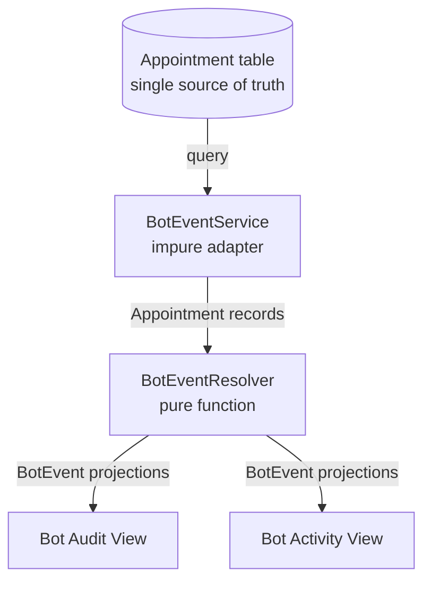

# ADR-007 — Derive Bot State from Source of Truth

**Status:** Accepted  
**Date:** 2026-05-22  
**Domain:** bot  
**Editorial:** CORE

> **Engineering Question Answered:** When a system needs an event feed derived from existing data, when is it correct to derive that feed at query time from the existing source of truth, and when does the system genuinely need a dedicated event table?

---

## Problem

The administrative panel requires an event feed showing the bot's operational history: which appointments the bot routed, which decisions the owner approved or rejected, and when. Building this feed requires choosing between two architecturally different approaches: derive the events at query time from the `Appointment` table (which already contains the relevant audit columns), or introduce a dedicated `bot_events` table that records each action as an immutable append at the time it occurs. The two approaches make different trade-offs on consistency guarantees, test surface, migration cost, and operational complexity. The choice becomes load-bearing for the audit and activity surfaces the panel provides.

## Context

The `Appointment` table already contained the information needed to reconstruct the bot's history. Columns recording whether an appointment was bot-created, who approved or rejected it, and the timestamps of each transition had been added incrementally as the audit requirements became clear. The full event history was derivable from the current state of the row.

The alternative — a `bot_events` table — is the canonical event sourcing pattern. Each action writes an immutable append-only row at the time it occurs. The event stream can then be replayed, projected, and consumed by multiple downstream systems. Event sourcing is the right answer for forensic lineage, multi-consumer streaming, and full historical reconstruction.

The question was whether those requirements were present in the system at this stage.

At the time of this decision: the administrative panel served a small number of pilot businesses; per-business appointment volume was measured in hundreds, not thousands; no legal or regulatory request had been made for forensic event lineage; no second consumer of an event stream existed beyond the panel itself.

The gap between "event sourcing would be the correct long-term architecture" and "event sourcing is the correct choice right now" was the central question this decision had to answer.

## Decision

Bot events are derived at query time from the `Appointment` table using a pure function (`BotEventResolver`). No dedicated event table is created.

`BotEventResolver` takes an `Appointment` record and returns a list of `BotEvent` projections. It is a deterministic, side-effect-free function: the same appointment input produces the same events on every invocation. `BotEventService` wraps it as an impure adapter: it issues the database query and maps the results through the resolver.

The `Appointment` table is the single source of truth for the bot's history.

### Why derive rather than store

**Single source of truth.** If a `bot_events` table existed alongside `appointments`, two sources would need to agree on what the bot did. Any write path that updated one without the other would produce drift. Drift in audit data is worse than approximate audit data: it is undetected inaccuracy.

**Deterministic testing.** A pure function over appointment records is testable with parameterised inputs and expected outputs. Event sourcing requires testing write ordering, idempotency, deduplication, and replay — a larger test surface for the same operational question.

**No migration cost.** Deriving from existing columns requires no new table, no backfill, and no dual-write transition. The audit columns existed; the resolver assembles them.

**Right-sized for current requirements.** Deriving events from a few hundred to a few thousand rows per business is computationally trivial. The operational overhead of maintaining a separate event table is real; the benefit at this volume is not.

### Operational audit vs forensic audit

This decision deliberately accepts a distinction between two different audit requirements that are often conflated:

**Operational audit** answers: what did the bot do today? Which decisions are pending? Which appointments were recently handled? The panel provides this by deriving from the `Appointment` table. The granularity is a snapshot of current state. This is sufficient for daily operational use.

**Forensic audit** answers: what was the exact sequence of every state transition, for a specific appointment, triggered by what actor, with what before-and-after state? This is required for legal disputes and regulatory investigations. The system satisfies this through external event capture and database backups. These are different systems serving different requirements.

Conflating operational and forensic audit requirements leads to building event sourcing infrastructure before the forensic requirement exists — paying the cost of the complexity without yet benefiting from it.

### Phone masking at the backend, not the frontend

The bot audit view displays customer identifiers. A decision adjacent to this ADR: phone numbers in audit responses are masked at the backend (`+34 *** *** 111` format), not hidden via CSS or JavaScript. Frontend masking is not data minimisation — the full value is present in the network response. A separate authenticated endpoint, verified by session role, serves the unmasked value on explicit request. This applies regardless of whether the audit feed is derived or event-sourced.

### When to revisit this decision

This architecture should be reconsidered when any of these triggers is reached:

1. Per-business appointment volume exceeds approximately 5,000 rows, and query-time derivation shows measurable performance impact
2. A legal or regulatory request requires reconstructing exact state-change lineage that the audit columns do not capture
3. A second consumer of the event stream emerges — a service, a notification system, or a reporting pipeline — that would benefit from a real-time feed rather than a derived query

When any of these triggers is reached, a new ADR should evaluate event sourcing. The migration path is known: introduce dual-write from the `Appointment` service to a new `bot_events` table, backfill from the existing audit columns, verify parity, then cut over.

## Alternatives Considered

| Option | Description | Why Rejected |
|---|---|---|
| Dedicated `bot_events` table (event sourcing) | Append-only immutable event log; each action writes a row at the time it occurs | Superior for forensic lineage and multi-consumer streaming. Not justified at current scale or with current requirements. The operational cost is real; the benefit is theoretical until a trigger is reached |
| Materialised view | Pre-compute the event projection and persist it | Adds synchronisation burden (when to refresh, how to invalidate) without removing the derivation logic. Adds complexity without resolving the underlying question |
| Real-time WebSocket push | Push events as they occur rather than deriving on poll | Requires sticky sessions, reconnection logic, heartbeat management, and a second code path alongside the REST API. Not justified for a small number of concurrent operators |

## Consequences

### Positive
- The panel's event feed is complete without introducing any new table, any new write path, or any synchronisation concern.
- `BotEventResolver` is independently testable as a pure function, without a database or application context.
- Schema evolution is additive: introducing a new audit dimension requires adding a column and updating the resolver. No event replay required.
- One source of truth for the bot's operational history.

### Negative
- If an appointment's audit columns are overwritten by a state transition (for example, revoking a cancellation and then cancelling again), the intermediate event is lost from the derived view. The system documents this limitation explicitly: the operational audit is reconstructive, not an immutable ledger.
- Appointments that existed before the audit columns were introduced have degraded event history. The panel shows what is available and documents the limitation.
- The derivation logic is coupled to the `Appointment` column schema. A schema change to an audit column requires a corresponding resolver update.

### Neutral
- The derive-vs-store decision is independent of the data minimisation decisions applied to the audit view (phone masking, filtered fields). Those decisions apply regardless of the underlying approach.
- The operational audit limitation is documented in the panel UI. Users who need forensic lineage are directed to the appropriate channel.

## Engineering Principle

When a system needs to project an event feed from an existing data source, the right question is not "should this be event sourcing?" but "what do the actual requirements specify?" Event sourcing is the correct answer for forensic lineage, multi-consumer event streaming, and full historical replay. For operational visibility — showing operators what the system did recently, in a context where the data source already contains the information — a pure function over the existing source of truth is simpler, testable, and eliminates dual-source synchronisation risk. The right level of complexity for a system is the level that satisfies its actual requirements, not the level that would satisfy requirements anticipated in the future. Documenting explicit triggers for when to upgrade the architecture — and treating them as the moment when the cost-benefit changes — is more valuable than premature infrastructure that the system does not yet justify.

## Related

- [ADR-011](./ADR-011-appointment-temporal-boundary.md) — the temporal boundary principle governs which events appear in the operational view (PFT-7: operational dashboards show future appointments only)
- [ADR-002](./ADR-002-blocked-slot-state-machine.md) — BlockedSlot state machine; the named audit columns on `blocked_slots` (approved_*, rejected_*, cancelled_*) are the schedule-change data source for the bot audit derive architecture
- [ADR-003](./ADR-003-hybrid-audit-strategy.md) — the three-layer audit architecture that formally defines the Layer 2 named audit columns the bot audit view derives its event feed from

## Source Code Reference

*Populated when source code is present (v0.3.0+).*

- `BotEventResolver.java` — pure function: takes an `Appointment` record, returns `List<BotEvent>`. Contains no I/O. Fully testable in isolation.
- `BotEventService.java` — impure adapter: issues the database query, applies PFT-7 filtering, maps results through the resolver
- `BotAuditController.java` — REST endpoint serving the audit view; applies phone masking at the response layer