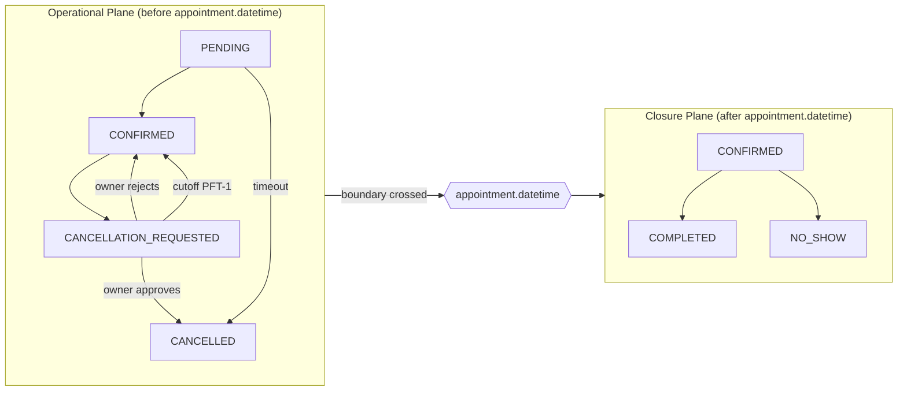

# ADR-011 — Appointment Temporal Boundary (PFT)

**Status:** Accepted  
**Date:** 2026-06-11  
**Domain:** appointment  
**Editorial:** FOUNDATIONAL

> **Engineering Question Answered:** When a domain entity's semantics depend fundamentally on whether a specific timestamp has passed, how do you ensure that every operation in the system respects that boundary without relying on each developer to remember to check it?

---

## Problem

A production incident during beta exposed a class of design defect that no individual bug fix could address. An owner rejected a customer's cancellation request several hours after the appointment time had already passed. The system dispatched an outbound notification to the customer about a past event — semantically incoherent. Moments later, a deferred reminder fired, announcing an imminent appointment that had already taken place. Both failures had the same root cause: the system had no formal concept of what it means for `appointment.datetime` to be in the past, and therefore no consistent way to prevent operations that are valid before that moment from being executed after it.

## Context

The `Appointment` entity contained a timestamp field — `appointment.datetime` — but no architectural principle governed what that timestamp meant for the lifecycle of operations around it. Some operations had ad-hoc temporal guards added in isolation: recording completion or no-show for a future appointment was blocked. But these guards were local, inconsistent, and left large classes of operations unprotected.

The `BlockedSlot` entity (ADR-002) had established a directly relevant precedent: when a `BlockedSlot`'s end time passes, a background job transitions it to `EXPIRED`. The pattern of a timestamp creating a behavioral change existed in the codebase. It had not been generalized.

The structural problem was this: any operation that "made sense before the appointment" could be triggered "after the appointment" if a temporal guard was omitted. Fixing the specific bug that surfaced in the incident would not prevent the next one — a reschedule-after-the-fact, a reminder-for-a-past-event, a notification-about-a-decision-on-a-past-appointment. Every future feature touching the appointment lifecycle would need to rediscover the boundary independently. The system needed a principle, not a patch.

## Decision

`appointment.datetime` is a temporal boundary that divides the lifecycle of every appointment into two distinct operational planes. All actions, all derived artefacts, and all outbound communications are governed by which plane they belong to.

**Plane 1 — Operational** (before `appointment.datetime`): booking, confirming, requesting cancellation, approving or rejecting a cancellation request, sending reminders, rescheduling. These operations affect what will happen. None are valid after the boundary has been crossed.

**Plane 2 — Closure** (after `appointment.datetime`): recording the outcome — COMPLETED, NO_SHOW, or the accounting of a CANCELLED appointment. These operations record what happened. None are valid before.

No derived artefact crosses the boundary. A reminder queued before the boundary is not dispatched after it. A cancellation request does not outlive the appointment it belongs to. Operator dashboards show only items that can still be acted on.

### The Seven Rules (PFT)

| Rule | Behaviour at the boundary |
|---|---|
| **PFT-1** | A cancellation request expires at `min(requestedAt + timeout, appointment.datetime)`. It never outlives the appointment it belongs to. |
| **PFT-2** | Approval and rejection decisions for pending bot-created appointments have a brief grace window near the appointment time — the legitimate case of an owner approving a booking for a customer who arrived slightly late. Outside this window, operational decisions are blocked for past appointments. |
| **PFT-3** | Approving or rejecting a cancellation request on a past appointment returns a 400 response guiding the operator to closure (COMPLETED / NO_SHOW). |
| **PFT-4** | No reminder is dispatched for a past appointment. Pending reminders for past appointments are terminated — not deferred, not retried. |
| **PFT-5** | Outbound notification to the customer about an operational decision (cancellation approved, cancellation rejected) is only sent if the appointment is in the future. |
| **PFT-6** | Reschedule, revoke (CANCELLED → CONFIRMED), and direct confirmation of past appointments are blocked. Assignment of staff to a past appointment remains legal: it is a closure operation, recording who actually attended. |
| **PFT-7** | Operator interfaces — notification queues, activity dashboards, decision panels — show only items with future appointments. Past appointments requiring closure are surfaced through a dedicated closure mechanism, not mixed into the operational queue. |

### Derived state rather than materialized state

The temporal boundary does not introduce a new FSM state. A `CONFIRMED` appointment whose `datetime` has passed is still `CONFIRMED` — its status has not changed, only the plane it occupies. The boundary condition is a derived predicate, evaluated at read time: `status = CONFIRMED AND datetime < now()`.

Materializing this as a new state (e.g. `AWAITING_CLOSURE`) would require a background job to transition rows, creating a window during which the database state is inconsistent with clock reality. A derived predicate is always accurate because it is evaluated against the current clock at the moment it is needed.

The implementation encapsulates this predicate in a single method (`Appointment.isPast()`). Every operation that must be plane-aware calls this method. Inline reimplementation is prohibited: the predicate must have one definition, in one place, checked by one test.

## Alternatives Considered

| Option | Description | Why Rejected |
|---|---|---|
| Auto-reject pending requests at the boundary | Automatically move pending cancellation requests to rejected when the appointment time passes | Violates the "silence is not approval" invariant; sends outbound messages to customers about past appointments — the exact failure mode the incident produced |
| Auto-close appointments at the boundary | Automatically mark appointments COMPLETED or NO_SHOW when `datetime` passes | Invents information the system does not have: whether the customer attended. Corrupts outcome metrics with fabricated data |
| New AWAITING_CLOSURE state | Create an explicit FSM state for confirmed past appointments | Requires a background job with a consistency window; adds FSM complexity without adding information. The derived predicate already captures the condition exactly |
| Fix each temporal bug individually | Patch the specific interactions that failed without generalising | Does not prevent the next class of temporal bug. Every future feature would need to rediscover the boundary independently, and some would not |

## Consequences

### Positive
- The class of "operation on a past appointment" bugs is eliminated structurally. Any future operation that omits a temporal guard fails at the enforcement point, not at a downstream symptom.
- Operator queues are 100% actionable. No phantom items, no decisions that cannot be taken.
- No new FSM states, no new migrations, no new tables. The principle is enforced through guard clauses and predicate encapsulation over the existing schema.
- Outcome metrics (COMPLETED / NO_SHOW) reflect human-recorded ground truth, not automated inference.

### Negative
- Confirmed past appointments require manual closure. An operator must explicitly record whether the customer attended.
- A customer whose cancellation request expires at the temporal boundary receives no notification of the expiry. Silence is preferable to an incoherent message about a past event.
- Deployment ordering matters: the rules governing what happens at the boundary must be deployed as a coherent set. Rules that cut off pending state without simultaneously suppressing related notifications would produce new failures.

### Neutral
- The grace window near the appointment time (PFT-2) is a deliberately preserved exception: the legitimate case of approving a booking for a customer who is present but slightly late. The exception is documented and bounded.
- Future automation (auto-close after N days without manual action) is a product decision left open. The principle does not preclude it; it prevents premature closure.

## Engineering Principle

A timestamp in a domain model is not just a field — it is a potential boundary. When the meaning of an entity, the validity of its operations, and the consequences of state changes depend fundamentally on whether the current time is before or after a specific timestamp, that timestamp defines a plane boundary. The correct response is not to add temporal guards to each operation individually, but to encode the boundary as an explicit architectural principle that governs every operation uniformly. The ad-hoc alternative produces a system where every new feature must rediscover the boundary, and where any one engineer who forgets it introduces a new variant of the same class of bug. A formal boundary principle applied once is a guarantee that every future engineer who reads it — not every engineer who works in the area — is protected from the failure mode.

## Related

- [ADR-002](./ADR-002-blocked-slot-state-machine.md) — BlockedSlot established the precedent for timestamp-driven state transitions; the `EXPIRED` state follows the same temporal boundary pattern described here
- [ADR-007](./ADR-007-bot-panel-derive-architecture.md) — Bot activity dashboards must respect PFT-7; operational views show only future appointments
- [ADR-017](./ADR-017-appointment-fsm-design.md) — the six-state appointment FSM; ADR-011's temporal boundary governs which transitions are legal before and after `appointment.datetime`
- [Governance: state-machines.md](../governance/state-machines.md) — Canonical FSM definitions for all appointment states *(planned)*

## Source Code Reference

- `Appointment.isPast()` *(published — SC-1)* — the single encapsulated predicate for temporal boundary evaluation; the only correct definition of "has this appointment's time passed?"; used as the boundary guard in every PFT-gated operation
- `TemporalBoundaryIT.java` *(published — SC-6)* — integration tests for PFT-1, PFT-3, PFT-4, and PFT-5 against a real PostgreSQL instance; covers: reminder cancellation for past appointments, rejection of 