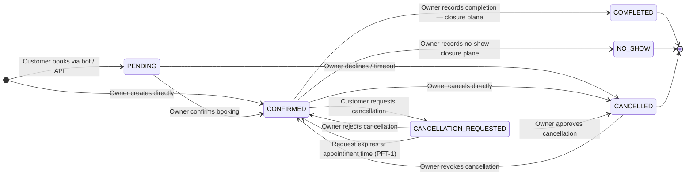

# ADR-017 — Six-State Appointment FSM

**Status:** Accepted  
**Date:** 2026-04-28  
**Domain:** appointment  
**Editorial:** FOUNDATIONAL

> **Engineering Question Answered:** An appointment lifecycle has more than two distinct inactive states — one where the customer is requesting cancellation and the business has not yet decided, and one where the appointment is definitively cancelled. How do you design the state machine to prevent these from collapsing into each other, and how do you map all six states cleanly onto the temporal boundary that divides operational actions from closure actions?

---

## Problem

A booking system that represents appointment status as a simple binary (active / cancelled) or a three-state model (pending / confirmed / cancelled) cannot represent a state that every appointment scheduling system implicitly handles: a customer has requested cancellation, but the owner has not yet decided whether to approve or reject it.

Without an explicit intermediate state, the system has two bad options. It can cancel the appointment immediately when the customer requests it — giving customers unilateral power to remove confirmed bookings from the business's schedule. Or it can add ad-hoc boolean flags to represent the pending review — an implicit state machine that is harder to reason about, audit, and test than an explicit one.

The same design pressure applies to the post-appointment phase: recording that the customer attended is categorically different from recording that they did not. Both actions produce a terminal state, but they carry different operational and financial meaning. A state machine that represents both as "cancelled" — or collapses them into a single "done" flag — loses information that the business legitimately needs.

## Context

The appointment is the core domain entity of the system. Its state governs:

- Whether a customer can book an overlapping slot (two confirmed appointments in the same slot are illegal)
- Whether an outbound reminder should be sent (only for operational-plane appointments)
- Whether the owner's action panel shows the appointment as requiring action
- Whether an employee's schedule shows them as occupied at a given time
- What is counted in revenue and no-show analytics

ADR-011 established the temporal boundary: `appointment.datetime` divides the appointment lifecycle into an **operational plane** (before the appointment time, where bookings and cancellations occur) and a **closure plane** (after, where the outcome is recorded). The state machine must map cleanly onto both planes.

The system serves two creation paths: a human owner creating an appointment through the administration panel, and a customer booking through the WhatsApp bot via the orchestration layer. These two paths produce different initial states — direct creation by the owner produces a confirmed booking, while a bot-created booking awaits the owner's confirmation.

## Decision

`Appointment` has a six-state machine. State is stored as an enum column on the entity. Transitions not explicitly listed in the table below are rejected by the service layer. Default deny: an unlisted transition is illegal.

### State semantics

| State | Meaning | Plane | Terminal? |
|---|---|---|---|
| `PENDING` | Booking created by the customer; awaiting owner confirmation | Operational | No |
| `CONFIRMED` | Owner has confirmed the booking; the appointment is active | Both | No |
| `CANCELLATION_REQUESTED` | Customer has requested cancellation; owner decision is pending | Operational | No |
| `CANCELLED` | The appointment will not take place; definitively cancelled | Operational | Conditionally — see revoke |
| `COMPLETED` | Service was delivered; owner has recorded the outcome | Closure | Yes |
| `NO_SHOW` | Customer did not appear; owner has recorded the outcome | Closure | Yes |

### Transition rules

| From | To | Who can trigger | Notes |
|---|---|---|---|
| (creation) → `PENDING` | Customer booking via bot or API | System (bot path) | The customer has no authority to produce a `CONFIRMED` booking directly |
| (creation) → `CONFIRMED` | Owner creates a booking directly | OWNER / ADMIN | Owner creation skips the review queue — the owner is the reviewer |
| `PENDING` → `CONFIRMED` | Owner confirms the booking request | OWNER / ADMIN | Moves the appointment into the active schedule |
| `PENDING` → `CANCELLED` | Owner declines, or a pending booking times out | OWNER / ADMIN / System | The customer is notified; the slot becomes available |
| `CONFIRMED` → `CANCELLATION_REQUESTED` | Customer or bot requests cancellation | Customer / Bot | Does not cancel the appointment; opens a review item for the owner |
| `CONFIRMED` → `CANCELLED` | Owner cancels directly | OWNER / ADMIN | Owner authority to cancel a confirmed booking without going through the review queue |
| `CANCELLED` → `CONFIRMED` | Owner revokes the cancellation | OWNER / ADMIN | Only valid in the operational plane; blocked after `appointment.datetime` by ADR-011 PFT-6 |
| `CANCELLATION_REQUESTED` → `CANCELLED` | Owner approves the cancellation request | OWNER / ADMIN | Customer is notified of the decision |
| `CANCELLATION_REQUESTED` → `CONFIRMED` | Owner rejects the cancellation request | OWNER / ADMIN | Appointment is restored to active; customer is notified |
| `CANCELLATION_REQUESTED` → `CONFIRMED` | Request expires at `appointment.datetime` | System (PFT-1) | A cancellation request that reaches the appointment time without a decision is expired — silence is not approval |
| `CONFIRMED` → `COMPLETED` | Owner records that the service was delivered | OWNER / ADMIN | Closure-plane only — blocked before `appointment.datetime` |
| `CONFIRMED` → `NO_SHOW` | Owner records that the customer did not appear | OWNER / ADMIN | Closure-plane only — blocked before `appointment.datetime` |

### The CANCELLATION_REQUESTED invariant

The existence of `CANCELLATION_REQUESTED` as a distinct state enforces a specific governance decision: **a customer cannot unilaterally cancel a confirmed appointment**. The customer's request creates a review item for the owner. Only the owner's approval transitions the appointment to `CANCELLED`.

Without this state, the system has two options, both worse:

1. Immediate cancellation on customer request — the customer has unilateral cancellation authority over confirmed bookings, which removes the business's ability to manage their schedule.
2. A boolean flag `cancellationRequested = true` alongside the current status — an implicit state machine where the actual state is the combination of two fields, and where it is possible to represent the undefined combination `status = CANCELLED, cancellationRequested = true`.

The explicit state eliminates both problems. A `CANCELLATION_REQUESTED` appointment is still in the schedule; it cannot be double-booked. The owner's action queue surfaces it as requiring a decision. The transition from `CANCELLATION_REQUESTED` to either `CANCELLED` or `CONFIRMED` is the only way the request resolves.

### Temporal plane mapping

Each state maps to a plane governed by ADR-011:

**Operational plane** (actions valid before `appointment.datetime`): `PENDING`, `CONFIRMED`, `CANCELLATION_REQUESTED`, `CANCELLED`.

**Closure plane** (actions valid after `appointment.datetime`): the `CONFIRMED → COMPLETED` and `CONFIRMED → NO_SHOW` transitions.

The `CANCELLED` state is reachable from the operational plane and is also a terminal state in the closure plane — a cancelled appointment that reaches its `datetime` without being reinstated simply remains `CANCELLED`. No closure action is required or valid for a `CANCELLED` appointment.

`CONFIRMED` spans both planes. A `CONFIRMED` appointment is active in the operational plane (it can be rescheduled, cancelled, or moved to `CANCELLATION_REQUESTED`). After `appointment.datetime`, the same `CONFIRMED` status places the appointment in the closure plane where only `COMPLETED` and `NO_SHOW` are valid.

### Outcome recording is human-asserted

`COMPLETED` and `NO_SHOW` are not computed by the system. The system does not infer whether the customer attended. Automating outcome recording would require the system to assert facts it does not know — a past `CONFIRMED` appointment might be completed, might be a no-show, or might have had circumstances the system is unaware of. The owner records the outcome manually, and that record is the ground truth for revenue analytics, staff performance reporting, and dispute resolution.

### Revoke (CANCELLED → CONFIRMED)

A cancelled appointment can be reinstated by the owner before the appointment time. This is the `CANCELLED → CONFIRMED` transition. After `appointment.datetime`, revoke is blocked by ADR-011 PFT-6 — an owner cannot un-cancel a past appointment. The business reason is clear: reinstating a past appointment into the schedule creates a record that implies the service will occur, which it cannot.

## Rationale

**Six states capture the full lifecycle without over-engineering.** Adding a `DISPUTED` state, a `PENDING_RESCHEDULE` state, or a `CLOSED` superstate was considered and rejected. The six states cover every operationally meaningful condition an appointment can be in, with no conflation and no redundancy.

**Explicit FSM over boolean flags.** Every implicit state machine — one that derives state from the combination of boolean fields — carries the risk of undefined combinations, silent bugs, and missed transitions. An explicit `status` enum column has one current value. The history of transitions is the audit log. The current state is unambiguous.

**Default-deny transition validation.** The service layer validates every transition against the table above. Any transition not in the table is rejected. This means adding a new transition requires a deliberate decision — it cannot happen by accident.

**Temporal plane mapping from ADR-011.** The six states map onto ADR-011's two planes without any new machinery. The temporal boundary does not introduce a new state — it changes which transitions are legal for existing states, enforced by `Appointment.isPast()`.

## Alternatives Considered

| Option | Why Rejected |
|---|---|
| Three states (PENDING / CONFIRMED / CANCELLED) | Cannot represent a pending cancellation review. Immediate cancellation on customer request removes owner authority. Boolean flag workaround produces an implicit FSM with undefined combinations. |
| Two-phase cancellation without an explicit state | Storing `cancellationRequested = true` alongside `status = CONFIRMED` conflates two separate states in one field combination. The undefined case (`status = CANCELLED AND cancellationRequested = true`) must be guarded against separately. Code that reads the "current state" must check two fields. |
| Auto-close at temporal boundary (new AWAITING_CLOSURE state) | Rejected in ADR-011 — requires a background job with a consistency window; adds FSM complexity without adding information. The derived predicate (`Appointment.isPast()`) is always accurate and requires no background job. |
| Automated COMPLETED / NO_SHOW after N days | Invents information the system does not have. An operator who never marks an appointment might have a legitimate reason (dispute, late cancellation, partial service). Automating the outcome corrupts metrics with guessed data. |

## Consequences

### Positive

- `CANCELLATION_REQUESTED` preserves owner authority over schedule changes initiated by customers. The review step is explicit, not optional.
- Each state has exactly one meaning. Code that reads `status` does not need to reason about field combinations.
- The transition table is the complete specification of legal appointment lifecycle changes. A new engineer can read it and understand every permitted operation.
- `COMPLETED` and `NO_SHOW` are ground-truth records asserted by a human with knowledge of what occurred.
- The six states map cleanly onto ADR-011's temporal planes without additional state or migration.

### Negative

- Outcomes require manual recording. An operator who does not record the outcome leaves the appointment in `CONFIRMED` status indefinitely. A background process that surfaces unresolved past appointments is required for operational hygiene.
- Six states with a many-to-many transition graph requires explicit test coverage for every legal and illegal transition combination. The test surface is larger than a simple status field.

### Neutral

- The `CANCELLATION_REQUESTED → CONFIRMED` expiry transition (PFT-1) fires at `appointment.datetime`, not after an arbitrary timeout. This is intentional: the deadline for a cancellation review is the appointment itself, not an administrative window.
- A `CONFIRMED` appointment whose time has passed is still `CONFIRMED` — the status does not change at the boundary. The plane is determined by `Appointment.isPast()` at read time, not by a background job that transitions rows. See ADR-011.

## Engineering Principle

An entity with more than one kind of inactive state — more than one way to not be in its normal operating condition — requires more than one explicit state to represent those conditions. Collapsing distinct states into a single value loses information that other parts of the system depend on. The correct response is not to add boolean modifiers alongside an inadequate status field, but to design the state machine with the number of states the domain actually requires. Each additional state is a constraint on illegal combinations: a `CANCELLATION_REQUESTED` appointment cannot simultaneously be in `CANCELLED` by definition of the enum value, whereas an implicit two-field combination has no such guarantee. The short-term cost of additional states — migration, transition table maintenance, test coverage — is outweighed by the permanent removal of the ambiguity that would otherwise accumulate in every operation that reads appointment status.

## Related

- [ADR-011](./ADR-011-appointment-temporal-boundary.md) — the temporal boundary that governs which transitions are valid before and after `appointment.datetime`; the FSM defined here is the entity that ADR-011's rules govern
- [ADR-002](./ADR-002-blocked-slot-state-machine.md) — BlockedSlot state machine; established the pattern of explicit FSMs for entities with meaningful lifecycle transitions; `CANCELLATION_REQUESTED` follows the same pattern as `REQUESTED` in the BlockedSlot FSM
- [ADR-004](./ADR-004-customer-lifecycle-states.md) — Customer lifecycle FSM; the `@PreUpdate` immutability pattern documented there applies here: illegal transitions are rejected by the service layer
- [ADR-003](./ADR-003-hybrid-audit-strategy.md) — every state transition is auditable; Layer 2 named columns on `appointments` record the actors and timestamps for reschedule, cancellation, and payment events; Layer 3 records cross-resource transitions
- [Governance: state-machines.md](../governance/state-machines.md) — canonical FSM definitions and transition tables for all lifecycle entities *(planned)*

## Source Code Reference

- `AppointmentStatus.java` *(published — SC-1)* — the six-state enum; maps to the `status` column; the order of enum values carries no significance (transitions are validated explicitly, not by ordinal)
- `Appointment.java` *(published — SC-1)* — the central domain entity; `@Version` for optimistic locking; `webhookEventId` idempotency key with partial unique index; `AppointmentSource` typed origin; cancellation lifecycle columns; bot approval audit columns; `isPast()` temporal boundary helper
- `AppointmentSource.java` *(published — SC-1)* — typed origin classification (PANEL, BOT, IMPORT, API); drives approval queue filter and timeout job scoping
- `Appointment.isPast()` *(published — SC-1)* — single predicate for temporal boundary evaluation; never re-implement `datetime.isBefore(now())` inline — always use this helper
- `AppointmentService.java` — transition validation at every entry point; `confirmAppointment()`, `cancelAppointment()`, `requestCancellation()`, `approveCancellation()`, `rejectCancellation()`, `recordCompletion(