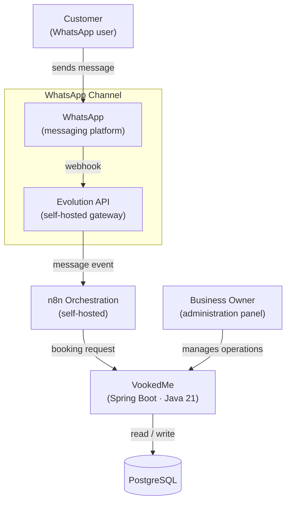
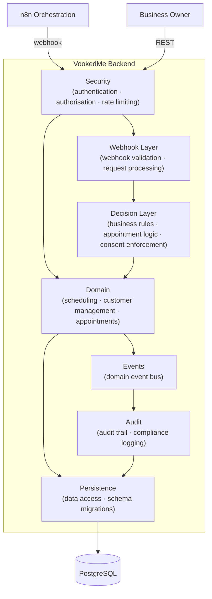

# System Architecture

> Two C4 diagrams. Two engineering questions. Both derived from decisions already recorded in the ADR suite and source artefacts.

Published as **AX-1** of the [Architecture Experience Journey](./README.md).

---

## System Context

> **Figure 1** — *System context — VookedMe appointment scheduling platform*: What is VookedMe and what systems interact with it? See [ADR-007 — Derive Bot State from Source of Truth](../adr/ADR-007-bot-panel-derive-architecture.md).

---

## Backend Organisation

> **Figure 2** — *Container diagram — VookedMe backend*: How is the backend organised? See [ADR-016 — Tenant Isolation Pattern](../adr/ADR-016-tenant-isolation-pattern.md).
