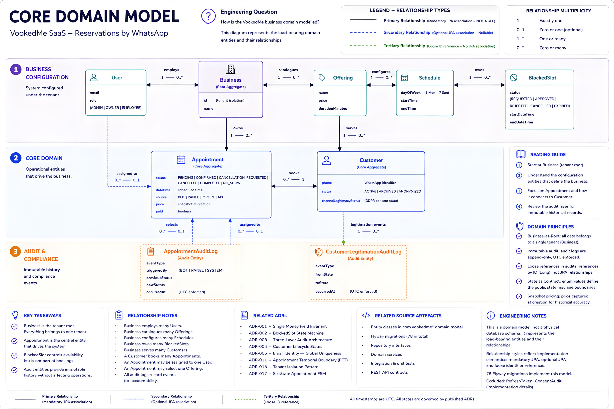

# Core Domain Model

> **AX-2 of the Architecture Experience Journey.** This document answers one engineering question: *How is the VookedMe business domain modelled?*

Published as **AX-2** of the [Architecture Experience Journey](./README.md).

---

## Engineering Question

**How is the VookedMe business domain modelled?**

This document describes the business model — the entities, relationships, and boundaries that give the domain its shape. It does not describe database tables, persistence configuration, or implementation detail.

---

## Purpose

VookedMe is a multi-tenant appointment scheduling platform. The domain model must express five architectural properties simultaneously:

**Multi-tenancy.** A single deployment serves N independent businesses. Every domain entity is scoped to a Business. This is not a convention — it is a structural constraint enforced at every service entry point (ADR-016).

**The appointment as a state machine.** An appointment is not a passive record. It has six named states with defined legal transitions, actor restrictions, and temporal guards. The status field drives a formal FSM (ADR-017).

**Four booking channels.** Appointments can arrive through the administration panel, the WhatsApp bot, bulk import, or the public API. The booking channel is a first-class property of the Appointment, not metadata — it drives approval routing, audit classification, and notification behaviour.

**GDPR-aware customer model.** A customer's eligibility to receive outbound WhatsApp messages is a structural property of the Customer entity, not a runtime check. The channelLegitimacyStatus field enforces this at the application layer.

**Append-only audit trail.** Appointment state transitions are recorded forensically. The AppointmentAuditLog is written synchronously in the same transaction as the mutation — committed ⟺ audited.

---

## Figure 1 — Core Domain Model

> **Figure 1** — *Core domain model — VookedMe appointment scheduling platform*: How is the VookedMe business domain modelled? See [ADR-016 — Tenant Isolation Pattern](../adr/ADR-016-tenant-isolation-pattern.md) and [ADR-017 — Six-State Appointment FSM](../adr/ADR-017-appointment-fsm-design.md).

---

## Main Aggregates

### Business — the tenant root

Every entity in the domain carries a `business_id` foreign key. The Business is the structural boundary of the tenant: a service method that accesses any business-scoped entity must verify the caller belongs to that Business before touching data. This is not a filter — it is a gate. See [ADR-016](../adr/ADR-016-tenant-isolation-pattern.md).

### Appointment — the core aggregate

The Appointment is the central entity of the domain. It binds a Customer to a Business, optionally assigns an employee (User), optionally references an offered service (Offering), and carries a formal lifecycle. Two properties give the Appointment its architectural weight:

**Source** (`BOT | PANEL | IMPORT | API`): the booking channel is captured at creation and is immutable. It drives approval routing — a bot-created appointment in `PENDING` state requires explicit owner approval before becoming `CONFIRMED` — and determines which audit events are emitted and how notifications are phrased.

**Temporal boundary** (ADR-011): `appointment.datetime` divides the lifecycle into two operationally distinct planes. Before the appointment time: operational decisions are possible (confirm, reschedule, cancel). After: only closure states are reachable (COMPLETED, NO_SHOW). No transition guard is hardcoded — the boundary is evaluated at runtime by the `isPast()` method on the entity.

**Money invariant** (ADR-001): the Appointment carries exactly two money-bearing fields — `price` (a snapshot of the agreed amount, set once at creation) and `paid` (an operational toggle). This count is a constitutional invariant. A third money field would cross the boundary from scheduling software into fiscal record-keeping, triggering Spanish fiscal regulation (RD 1007/2023) obligations the platform is not designed to fulfil.

### User — employees and operators

A User is a member of a Business with a role that determines what operations they can perform. The three roles — OWNER, ADMIN, EMPLOYEE — form the RBAC foundation. OWNER and ADMIN have business-wide authority; EMPLOYEE has scoped authority determined by the specific operation. Users are the only actors who authenticate via JWT; bot and customer actions arrive through the webhook channel without user identity.

### Capacity model — Offering, Schedule, BlockedSlot

The business configures its service catalogue through Offerings (name, price, duration). Recurring employee availability is defined through Schedules (day of week, time window). Ad-hoc capacity blocks — employee leave, business closures — are managed through BlockedSlots, which have their own approval lifecycle (ADR-002): EMPLOYEE actors submit requests; OWNER/ADMIN actors approve. Only `APPROVED` blocks affect availability queries.

### Audit — AppointmentAuditLog and CustomerLegitimationAuditLog

Both audit entities follow the same pattern: they are append-only, written synchronously in the same transaction as the mutation they record, and reference their subject by id rather than by JPA relationship. The loose reference (Long rather than `@ManyToOne`) is intentional — the audit record must survive anonymisation or deletion of the source entity.

`AppointmentAuditLog` records every appointment state transition with the actor, trigger source, before/after status, and UTC timestamp. `CustomerLegitimationAuditLog` records every change to `Customer.channelLegitimacyStatus` — the GDPR legitimacy state that governs whether the customer can receive outbound WhatsApp messages. See [ADR-003](../adr/ADR-003-hybrid-audit-strategy.md) and [ADR-015](../adr/ADR-015-art9-gdpr-minimisation-conversational-flow.md).

---

## Reading Notes

**The production schema evolved through 78 Flyway migrations.** This diagram intentionally represents only the load-bearing domain relationships required to understand the architecture. Every historical correction, column addition, index refinement, and schema constraint is visible in the migration history, but representing it here would obscure rather than explain the domain.

**Entities not shown:** ConsentAudit (records panel user acceptance of legal terms — GDPR evidence for the administration panel login flow), RefreshToken (JWT rotation infrastructure — see [ADR-018](../adr/ADR-018-jwt-refresh-token-rotation.md)). These are implementation and compliance infrastructure, not domain model entities.

**Appointment.employee is nullable.** Some businesses operate without employee assignment — appointments are visible to all staff and claimed when serviced. This is why the relationship is `User |o--o{ Appointment` rather than mandatory.

**Offering is nullable on Appointment.** The service name is snapshotted at creation (`serviceNameSnapshot`) so historical reports remain accurate when Offerings change or are removed after an appointment is created.

**Schedule is shown connected to Business only.** The Schedule entity defines recurring employee availability by day of week and time window. The relationship between a specific employee (User) and their Schedule is part of the availability configuration and is managed through the administration panel.

---

## Related ADRs

| ADR | Relevance to this diagram |
|---|---|
| [ADR-001 — Single Money Field Invariant](../adr/ADR-001-single-money-field.md) | Why Appointment has exactly two money-bearing fields and why the count is a constitutional invariant |
| [ADR-002 — BlockedSlot State Machine](../adr/ADR-002-blocked-slot-state-machine.md) | The five-state approval lifecycle of BlockedSlot |
| [ADR-003 — Three-Layer Audit Architecture](../adr/ADR-003-hybrid-audit-strategy.md) | Why AppointmentAuditLog is append-only, synchronous, and references by id |
| [ADR-004 — Customer Lifecycle States](../adr/ADR-004-customer-lifecycle-states.md) | The channelLegitimacyStatus field on Customer and its legal basis |
| [ADR-011 — Appointment Temporal Boundary](../adr/ADR-011-appointment-temporal-boundary.md) | How appointment.datetime divides the FSM into operational and closure planes |
| [ADR-015 — Art.9 GDPR in Conversational Flow](../adr/ADR-015-art9-gdpr-minimisation-conversational-flow.md) | Why CustomerLegitimationAuditLog exists and what it records |
| [ADR-016 — Tenant Isolation Pattern](../adr/ADR-016-tenant-isolation-pattern.md) | Why Business is the root of every entity's ownership chain |
| [ADR-017 — Six-State Appointment FSM](../adr/ADR-017-appointment-fsm-design.md) | The six AppointmentStatus values and their legal transitions |

---

## Related Source Artefacts

| Artefact | What it shows |
|---|---|
| [Appointment.java](../../src/main/java/com/vookedme/botmanager/appointment/entity/Appointment.java) | Core aggregate — all fields, relationships, temporal boundary helper, and optimistic locking |
| [AppointmentAuditLog.java](../../src/main/java/com/vookedme/botmanager/appointment/entity/AppointmentAuditLog.java) | Append-only audit record — loose FK, UTC timestamp, no JPA cascade |
| [BlockedSlot.java](../../src/main/java/com/vookedme/botmanager/schedule/entity/BlockedSlot.java) | Capacity block entity with five-state approval FSM and optimistic locking |
| [CustomerLegitimationAuditLog.java](../../src/main/java/com/vookedme/botmanager/customer/entity/CustomerLegitimationAuditLog.java) | Legitimation transition record — loose FK, data minimisation, GDPR evidence |
| [AppointmentStatus.java](../../src/main/java/com/vookedme/botmanager/appointment/entity/AppointmentStatus.java) | The six FSM states |
| [BlockedSlotStatus.java](../../src/main/java/com/vookedme/botmanager/schedule/entity/BlockedSlotStatus.java) | The five BlockedSlot lifecycle states |
