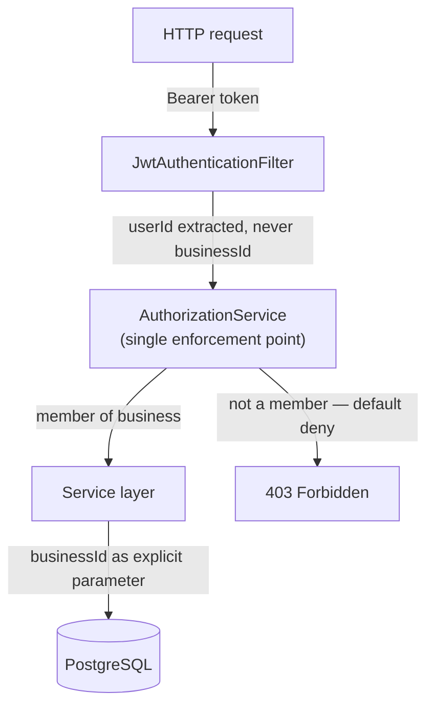
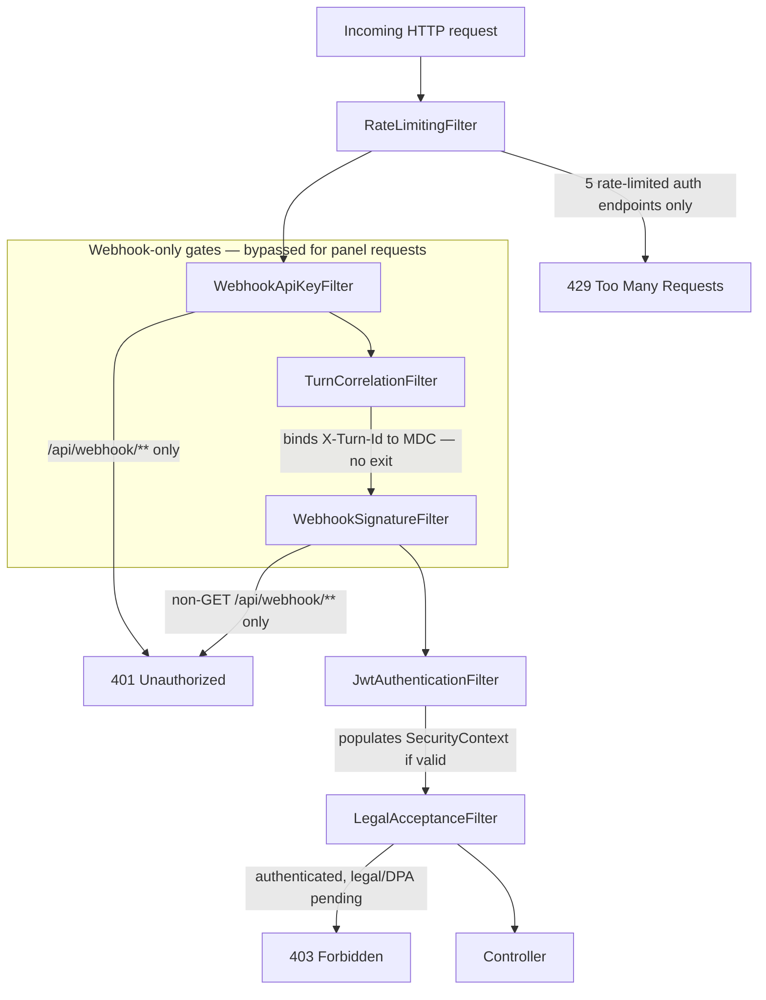
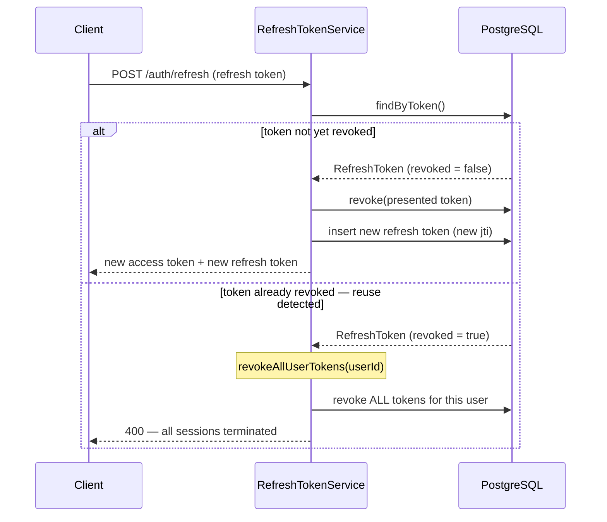

# Security Architecture

> **AX-5 of the Architecture Experience Journey.** This document answers three engineering questions: how tenant data is isolated, what the request pipeline looks like, and how sessions are protected against theft.

Published as **AX-5** of the [Architecture Experience Journey](./README.md).

---

## Engineering Question

**How does the system enforce tenant isolation, structure its request-security pipeline, and protect long-lived sessions against credential theft?**

This document covers three independent but related security mechanisms: the tenant isolation gate, the security filter chain, and JWT refresh token rotation. Together they form the security architecture referenced throughout the ADR suite.

---

## Figure 1 — Tenant Isolation Architecture

> **Figure 1** — *Tenant isolation architecture — single enforcement point*: How does the system ensure that data belonging to one tenant is structurally inaccessible to another, and where in the request lifecycle is this enforced? See [ADR-016 — Tenant Isolation Pattern](../adr/ADR-016-tenant-isolation-pattern.md).

**Reading notes.** `JwtAuthenticationFilter` extracts the authenticated `userId` from the JWT and populates the `SecurityContext`. It never extracts a `businessId` from the request body — the `businessId` used downstream is taken from the request path and validated against the authenticated user's membership by `AuthorizationService`. `AuthorizationService` is the single point in the codebase where business membership is checked; it exposes seven guard methods (`checkBusinessAccess`, `checkOwnerOrAdmin`, `checkSelfOrOwnerOrAdmin`, `checkSelfClaimOrOwnerOrAdmin`, `checkCanManageBlockForEmployee`, `checkCanDeleteBlock`, `checkAdmin`), all reachable through the same class. A caller who is not a member of the requested business receives a 403 that does not distinguish "business does not exist" from "you are not a member."

---

## Figure 2 — Security Filter Chain

> **Figure 2** — *Security filter chain — registration order and exit conditions*: What is the complete security pipeline for an incoming HTTP request, in what order are checks applied, and what is the exit response when each check fails? See [ADR-016](../adr/ADR-016-tenant-isolation-pattern.md), [ADR-018](../adr/ADR-018-jwt-refresh-token-rotation.md), [ADR-014](../adr/ADR-014-bot-data-minimisation-and-audit-log.md).

**Reading notes.** The six filters are registered in this exact order — `rateLimit → webhookApiKey → turnCorrelation → webhookSignature → jwt → legalAcceptance` — ahead of Spring Security's own `UsernamePasswordAuthenticationFilter`. Three of the six (`WebhookApiKeyFilter`, `TurnCorrelationFilter`, `WebhookSignatureFilter`) only act on `/api/webhook/**` paths and pass every other request through unmodified. `JwtAuthenticationFilter` does not itself issue a 401: on a missing or invalid token it silently leaves the request unauthenticated and passes it on; the 401 for an unauthenticated request to a protected route is issued afterward by Spring Security's own authorization check (`authorizeHttpRequests` / `anyRequest().authenticated()`), not by a filter in this chain. `LegalAcceptanceFilter` only evaluates requests that already carry an authenticated panel principal — webhook requests, whose principal is a different type, pass through unconditionally.

---

## Figure 3 — JWT Refresh Token Rotation Sequence

> **Figure 3** — *JWT refresh token rotation — happy path and theft detection*: What is the complete token rotation lifecycle, and at what exact point is token theft detected and contained? See [ADR-018 — JWT Refresh Token Rotation](../adr/ADR-018-jwt-refresh-token-rotation.md).

**Reading notes.** Every refresh token is single-use: a successful refresh revokes the presented token and issues a new one in the same transaction. Revocation is checked *before* expiration. Presenting an already-revoked token is treated as evidence of theft regardless of cause — the response is identical whether the reuse came from a client race condition or an attacker: every refresh token for that user is revoked, forcing re-authentication. The refresh token carries only the user's identifier and a `jti`; it carries no role or business claims, so a role or business change takes effect at the next access-token issuance rather than being deferred.

---

## Related ADRs

| ADR | Relevance to this document |
|---|---|
| [ADR-016 — Tenant Isolation Pattern](../adr/ADR-016-tenant-isolation-pattern.md) | The single-enforcement-point design behind Figure 1 |
| [ADR-018 — JWT Refresh Token Rotation](../adr/ADR-018-jwt-refresh-token-rotation.md) | The rotation and reuse-detection design behind Figure 3, and the JWT authentication step in Figure 2 |
| [ADR-014 — Bot Data Minimisation and Appointment Audit Log](../adr/ADR-014-bot-data-minimisation-and-audit-log.md) | The HMAC webhook signature verification in Figure 2 |
| [ADR-006 — User Identity Model](../adr/ADR-006-user-identity-model.md) | The global `User` identity that `AuthorizationService` checks business membership against |

---

## Related Source Artefacts

| Artefact | What it shows |
|---|---|
| [AuthorizationService.java](../../src/main/java/com/vookedme/botmanager/auth/service/AuthorizationService.java) | The single tenant-isolation enforcement point — seven guard methods |
| [JwtAuthenticationFilter.java](../../src/main/java/com/vookedme/botmanager/auth/security/JwtAuthenticationFilter.java) | JWT extraction; access-token vs. refresh-token discrimination via the `role` claim; silent pass-through on invalid tokens |
| [LegalAcceptanceFilter.java](../../src/main/java/com/vookedme/botmanager/auth/security/LegalAcceptanceFilter.java) | Post-JWT legal/DPA acceptance gate; whitelist for "fix the problem" endpoints |
| [WebhookApiKeyFilter.java](../../src/main/java/com/vookedme/botmanager/webhook/security/WebhookApiKeyFilter.java) | Shared-bearer credential check for `/api/webhook/**`; constant-time comparison |
| [WebhookSignatureFilter.java](../../src/main/java/com/vookedme/botmanager/webhook/security/WebhookSignatureFilter.java) | HMAC-SHA256 body signature verification; GET requests exempt |
| [TurnCorrelationFilter.java](../../src/main/java/com/vookedme/botmanager/webhook/security/TurnCorrelationFilter.java) | Binds `X-Turn-Id` to the logging MDC for conversational-turn correlation |
| [RateLimitingFilter.java](../../src/main/java/com/vookedme/botmanager/security/ratelimit/RateLimitingFilter.java) | In-memory per-IP, per-path rate limiting on five authentication endpoints |
| [RefreshToken.java](../../src/main/java/com/vookedme/botmanager/auth/entity/RefreshToken.java) | The persistence entity behind Figure 3 — `revoked`, `revokedAt`, `expiresAt`, device and IP metadata |
| [RefreshTokenService.java](../../src/main/java/com/vookedme/botmanager/auth/service/RefreshTokenService.java) | `verifyAndRotate()` and `revokeAllUserTokens()` — the rotation and reuse-detection logic in Figure 3 |

---

## Reading Notes

**Figure 2 corrects the filter order relative to earlier planning notes.** The registration order enforced in the security configuration is `rateLimit → webhookApiKey → turnCorrelation → webhookSignature → jwt → legalAcceptance`. This is the implementation ground truth this figure reflects.

**`AuthorizationService` has no `requireMembership()` method.** Early planning language for this batch referred to a single `requireMembership()` gate. The actual enforcement point is the same class, exposed instead as seven purpose-specific guard methods (see Figure 1 reading notes and [ADR-016](../adr/ADR-016-tenant-isolation-pattern.md)'s Source Code Reference). The engineering property — one class, one enforcement point, business identity never trusted from the request body — is unchanged; only the method-level description is corrected here to match source.

**`JwtService` and the security filter registration itself are not yet published source.** Figure 2 and Figure 3 describe filter ordering and token-issuance behaviour documented in ADR-016/ADR-018 and observed in the published filter classes; the class that wires the filter chain together is not part of the current Source Code Journey batches.
