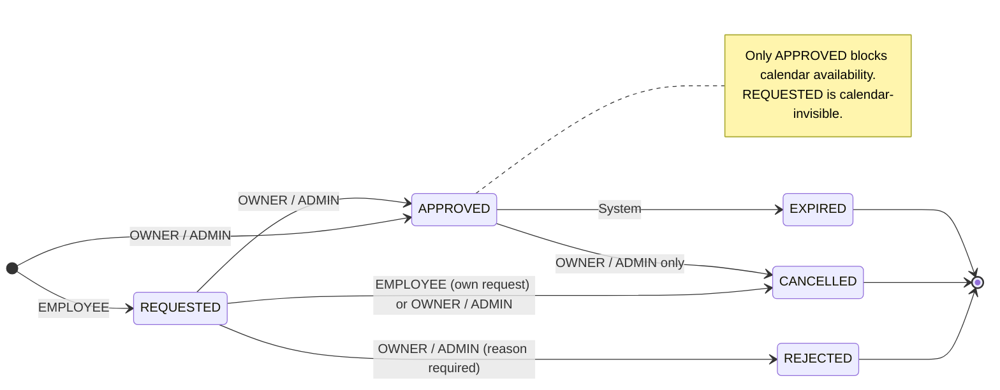

# Governance: State Machines

**Domain:** appointment, schedule  
**Status:** Draft — AX-3  
**Date:** 2026-07-13

> Canonical FSM definitions and transition tables for all lifecycle entities in the system. Each figure answers one engineering question and is grounded in the corresponding ADR. Implementation ground truth takes precedence over ADR text where discrepancies are explicitly documented.

---

## Contents

- [Figure 1 — Appointment lifecycle](#figure-1--appointment-lifecycle)
- [Figure 2 — BlockedSlot approval lifecycle](#figure-2--blockedslot-approval-lifecycle)

---

## Figure 1 — Appointment lifecycle

*(Figure pending insertion — AX-3 in progress)*

---

## Figure 2 — BlockedSlot approval lifecycle

> **Figure 2** — *BlockedSlot approval lifecycle — five states and calendar-visibility invariant*: How does the `BlockedSlot` state machine enforce the owner approval gate on employee-initiated availability blocks, and which state is the sole gateway to calendar availability? See [ADR-002](../adr/ADR-002-blocked-slot-state-machine.md).

### State semantics

| State | Meaning | Blocks calendar? | Terminal? |
|---|---|---|---|
| `REQUESTED` | Employee has submitted a block request; awaiting owner review | No | No |
| `APPROVED` | Owner has approved; block is effective | **Yes — the only state that blocks bookings** | No |
| `REJECTED` | Owner denied the request | No | Yes |
| `CANCELLED` | Request withdrawn (pre-approval) or block removed (post-approval) | No | Yes |
| `EXPIRED` | `end_datetime` has passed; historical record of a completed block period | No | Yes |

### Transition table

| From | To | Actor | Notes |
|---|---|---|---|
| (creation) → `REQUESTED` | EMPLOYEE | Self-approval is never permitted |
| (creation) → `APPROVED` | OWNER / ADMIN | Direct creation skips the approval queue. See implementation note below |
| `REQUESTED` → `APPROVED` | OWNER / ADMIN | |
| `REQUESTED` → `REJECTED` | OWNER / ADMIN | Rejection reason required (`rejection_reason` field) |
| `REQUESTED` → `CANCELLED` | EMPLOYEE (own request) or OWNER / ADMIN | Actor cannot reject own request (`rejectSelfApproval`). See implementation note below |
| `APPROVED` → `CANCELLED` | OWNER / ADMIN only | See implementation note below |
| `APPROVED` → `EXPIRED` | System | `BlockedSlotExpirationJob` — `end_datetime ≤ now` |

### Implementation notes — ADR-002 discrepancies

Three points in the implementation differ from or extend ADR-002. The diagram and table above reflect implementation ground truth. ADR-002 requires a future update to align with all three.

**`(creation) → APPROVED` — Bot actor:**  
ADR-002 lists OWNER / ADMIN only for direct-to-APPROVED creation. The implementation (`BlockedSlotService`, creation path) additionally routes Bot-originated blocks directly to APPROVED, treating Bot as operationally equivalent to OWNER / ADMIN for this transition. ADR-002 does not document this path.

**`REQUESTED → CANCELLED` actor:**  
ADR-002 specifies creator only. The implementation (`BlockedSlotStatus.java` Javadoc, `withdraw()` and `delete()` in `BlockedSlotService`) permits EMPLOYEE (own request) **or** OWNER / ADMIN. The broader actor set is the enforced rule.

**`APPROVED → CANCELLED` actor:**  
ADR-002 specifies OWNER / ADMIN or EMPLOYEE on self-owned blocks. A subsequent policy change revoked EMPLOYEE authority entirely for APPROVED cancellations (`BlockedSlotService.delete()`, lines 654–661). OWNER / ADMIN only is the enforced rule. ADR-002 must be updated to reflect this.
