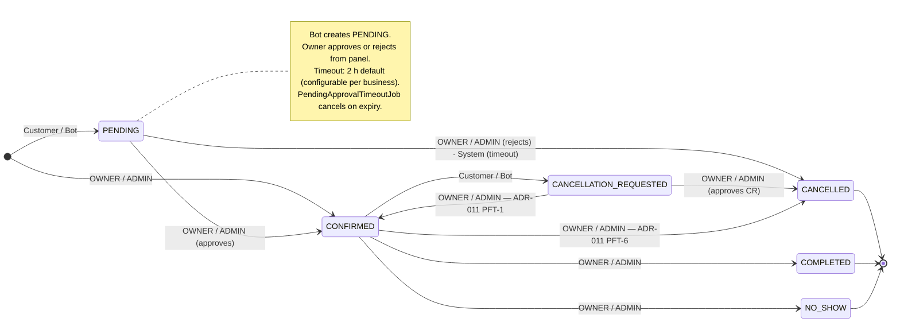
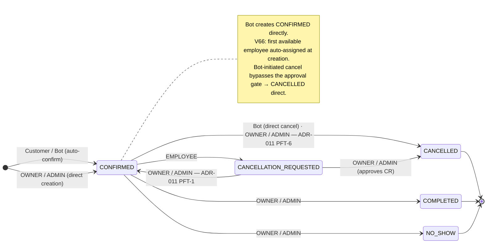
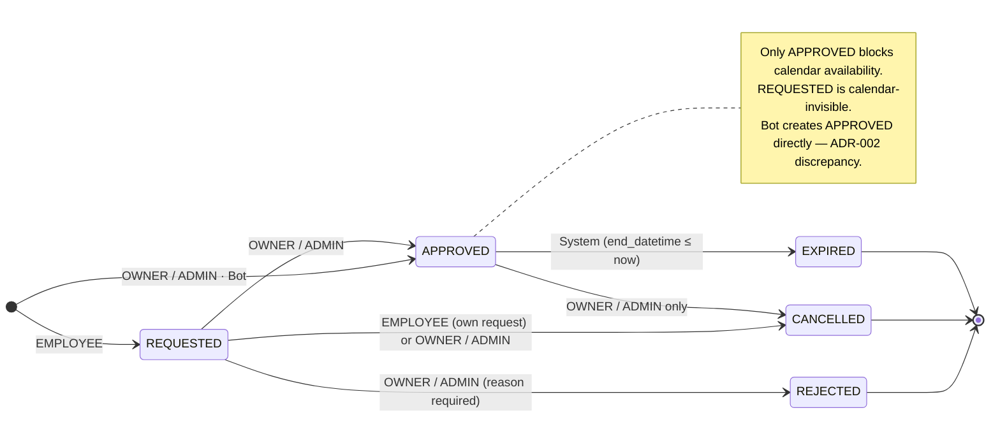

# Governance: State Machines

**Domain:** appointment, schedule  
**Status:** Draft — AX-3  
**Date:** 2026-07-14

> Canonical FSM definitions and transition tables for all lifecycle entities in the system. Each figure answers one engineering question and is grounded in the corresponding ADR. Implementation ground truth takes precedence over ADR text where discrepancies are explicitly documented.

---

## Contents

- [Figure 1 — Appointment lifecycle](#figure-1--appointment-lifecycle)
  - [Figure 1.a — Modo Recepcionista (APPROVAL\_REQUIRED)](#figure-1a--modo-recepcionista-approval_required)
  - [Figure 1.b — Modo Autónomo (AUTO\_CONFIRM)](#figure-1b--modo-autónomo-auto_confirm)
  - [Shared state semantics](#shared-state-semantics)
- [Figure 2 — BlockedSlot approval lifecycle](#figure-2--blockedslot-approval-lifecycle)

---

## Figure 1 — Appointment lifecycle

The appointment lifecycle FSM has **six states** regardless of operating mode. What changes per mode is the initial state that the Bot assigns on creation, and the cancellation path the Bot follows. The mode is a per-business configuration (`BotBookingMode` field on `Business`).

**Three bot modes exist (`BotBookingMode.java`).** Two produce `Appointment` rows and are shown below. The third — `TRIAGE` (Modo Supervisado) — produces a `BotRequest` entity instead; it has no appointment lifecycle and is therefore out of scope for this document.

| Mode | Bot creates | Bot cancels | Status |
|---|---|---|---|
| `APPROVAL_REQUIRED` | `PENDING` — owner approves from panel | `CANCELLATION_REQUESTED` — owner decides | ✅ LIVE |
| `AUTO_CONFIRM` | `CONFIRMED` — directly, employee auto-assigned (V66) | `CANCELLED` — direct, no gate | ✅ LIVE (default) |
| `TRIAGE` | No `Appointment` — creates `BotRequest` only | — | ⏸️ Not implemented |

---

### Figure 1.a — Modo Recepcionista (APPROVAL\_REQUIRED)

> **Figure 1.a** — *Appointment lifecycle — Modo Recepcionista (`APPROVAL_REQUIRED`)*: In this mode the bot acts as a receptionist — it books a slot as `PENDING` and the owner holds the approval gate. Which transitions are legal before and after `appointment.datetime`? See [ADR-011](../adr/ADR-011-cancellation-policy.md).

---

### Figure 1.b — Modo Autónomo (AUTO\_CONFIRM)

> **Figure 1.b** — *Appointment lifecycle — Modo Autónomo (`AUTO_CONFIRM`)*: In this mode the bot has full booking authority — it creates `CONFIRMED` directly and cancels without an approval gate. This is the V64 migration default for all businesses. See [ADR-011](../adr/ADR-011-cancellation-policy.md).

---

### Shared state semantics

Both modes share the same six states. The mode controls which actor initiates which transition — it does not add or remove states.

| State | Meaning | Terminal? |
|---|---|---|
| `PENDING` | Awaiting owner confirmation. Primary creation state in `APPROVAL_REQUIRED`; reachable from panel in `AUTO_CONFIRM`. | No |
| `CONFIRMED` | Appointment is confirmed and slot is blocked. Primary creation state in `AUTO_CONFIRM`. | No |
| `CANCELLATION_REQUESTED` | Customer or Bot has requested cancellation; owner must approve or reject. | No |
| `CANCELLED` | Appointment cancelled — by owner, by system timeout, or by bot (direct in `AUTO_CONFIRM`). | Yes |
| `COMPLETED` | Appointment occurred and was marked as attended. Only reachable after `appointment.datetime`. | Yes |
| `NO_SHOW` | Appointment slot passed and customer did not attend. Only reachable after `appointment.datetime`. | Yes |

**Temporal boundary:** `appointment.datetime` partitions the lifecycle. `COMPLETED` and `NO_SHOW` are only reachable after this boundary (Closure Plane). All other active transitions occur before it (Operational Plane). See ADR-017.

---

## Figure 2 — BlockedSlot approval lifecycle

> **Figure 2** — *BlockedSlot approval lifecycle — five states and calendar-visibility invariant*: How does the `BlockedSlot` state machine enforce the owner approval gate on employee-initiated availability blocks, and which state is the sole gateway to calendar availability? See [ADR-002](../adr/ADR-002-blocked-slot-state-machine.md).

### State semantics

| State | Meaning | Blocks calendar? | Terminal? |
|---|---|---|---|
| `REQUESTED` | Employee has submitted a block request; awaiting owner review | No | No |
| `APPROVED` | Owner has approved; block is effective | **Yes — the only state that blocks bookings** | No |
| `REJECTED` | Owner denied the request | No | Yes |
| `CANCELLED` | Request withdrawn (pre-approval) or block removed (post-approval) | No | Yes |
| `EXPIRED` | `end_datetime` has passed; historical record of a completed block period | No | Yes |

### Transition table

| From | To | Actor | Notes |
|---|---|---|---|
| (creation) → `REQUESTED` | EMPLOYEE | Self-approval is never permitted |
| (creation) → `APPROVED` | OWNER / ADMIN | Direct creation skips the approval queue. See implementation note below |
| (creation) → `APPROVED` | Bot | See implementation note below — ADR-002 discrepancy |
| `REQUESTED` → `APPROVED` | OWNER / ADMIN | |
| `REQUESTED` → `REJECTED` | OWNER / ADMIN | Rejection reason required (`rejection_reason` field) |
| `REQUESTED` → `CANCELLED` | EMPLOYEE (own request) or OWNER / ADMIN | Actor cannot reject own request (`rejectSelfApproval`). See implementation note below |
| `APPROVED` → `CANCELLED` | OWNER / ADMIN only | See implementation note below |
| `APPROVED` → `EXPIRED` | System | `BlockedSlotExpirationJob` — `end_datetime ≤ now` |

### Implementation notes — ADR-002 discrepancies

Three points in the implementation differ from or extend ADR-002. The diagram and table above reflect implementation ground truth. ADR-002 requires a future update to align with all three.

**`(creation) → APPROVED` — Bot actor:**  
ADR-002 lists OWNER / ADMIN only for direct-to-APPROVED creation. The implementation (`BlockedSlotService`, creation path) additionally routes Bot-originated blocks directly to APPROVED, treating Bot as operationally equivalent to OWNER / ADMIN for this transition. ADR-002 does not document this path.

**`REQUESTED → CANCELLED` actor:**  
ADR-002 specifies creator only. The implementation (`BlockedSlotStatus.java` Javadoc, `withdraw()` and `delete()` in `BlockedSlotService`) permits EMPLOYEE (own request) **or** OWNER / ADMIN. The broader actor set is the enforced rule.

**`APPROVED → CANCELLED` actor:**  
ADR-002 specifies OWNER / ADMIN or EMPLOYEE on self-owned blocks. A subsequent policy change revoked EMPLOYEE authority entirely for APPROVED cancellations (`BlockedSlotService.delete()`, lines 654–661). OWNER / ADMIN only is the enforced rule. ADR-002 must be updated to reflect this.
