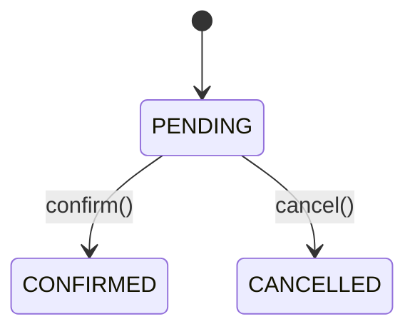

# Repository Standards

**Repository:** `vookedme-engineering`  
**Document Version:** 1.0  
**Date:** 2026-07-09  
**Status:** Canonical — enforce consistently

---

## §1. Markdown Style

### 1.1 Headings

Use ATX-style headings (`#`) only. Never underline-style (`===`/`---`).

```markdown
# H1 — document title (one per file)
## §1. H2 — major section
### 1.1 H3 — subsection
#### H4 — use sparingly
```

Section numbers in H2 headings (`§1.`, `§2.`, etc.) are used in foundation and standards documents. ADRs and architecture docs use descriptive headings without section numbers.

### 1.2 Prose Style

Write in English. Active voice preferred. Technical precision over warmth. One idea per sentence. No hedging unless genuinely uncertain.

**Preferred:**
> The `AuthorizationService` validates tenant membership before every resource access.

**Avoid:**
> The `AuthorizationService` basically checks if the user belongs to the right tenant, which is an important security feature of the multi-tenant architecture.

### 1.3 Tables

Use Markdown tables for structured comparisons and matrices. Columns aligned with `|---|` separators.

```markdown
| Column A | Column B | Column C |
|---|---|---|
| value    | value    | value    |
```

Keep table cells concise — move long explanations to prose below the table.

### 1.4 Code Blocks

Always specify the language for syntax highlighting:

```markdown
```java
// Java source
```

```sql
-- SQL migrations
```

```bash
# Shell commands
```

```yaml
# YAML configuration
```

```

For file paths and short inline identifiers, use backtick inline code: `AuthorizationService.java`, `V42__add_audit_log.sql`.

### 1.5 Links

Internal document links use relative paths:

```markdown
See [ADR-001](../adr/ADR-001-single-money-field.md)
See [ARCHITECTURE.md](../architecture/ARCHITECTURE.md)
```

External links: always include the full URL, never rely on link text alone to identify the target.

### 1.6 Emphasis

- **Bold** for technical terms introduced for the first time in a document, and for field/class names in prose
- *Italic* for titles, foreign-language terms, and genuine emphasis (rare)
- No `ALL CAPS` for emphasis in prose (ALL CAPS is reserved for constants in code)

### 1.7 Lists

Use bullet lists for unordered collections. Use numbered lists only when order matters.

Keep list items parallel in grammatical structure. Each item either starts with a verb or starts with a noun — never mixed.

### 1.8 Callouts / Admonitions

Use blockquotes (`>`) for important architectural notes or warnings:

```markdown
> **Note:** This service is the single source of truth for permission checks.
> Any bypass is a security vulnerability, not a shortcut.
```

### 1.9 File Length

No hard limit, but apply judgement:
- ADRs: typically 200–600 words
- Architecture documents: typically 500–1500 words
- Governance documents: as long as the rule set requires — tables are efficient
- Foundation documents: as long as necessary (these are read once by serious readers)

---

## §2. Naming Conventions

### 2.1 Files

| Type | Convention | Example |
|---|---|---|
| Root GitHub files | `SCREAMING_SNAKE.md` | `README.md`, `CONTRIBUTING.md`, `SECURITY.md` |
| Repository meta documents (`docs/meta/`) | `kebab-case.md` | `engineering-foundation.md`, `release-strategy.md` |
| Architecture documents | `SCREAMING_SNAKE.md` | `ARCHITECTURE.md`, `DATA_MODEL.md` |
| ADRs | `ADR-NNN-kebab-case.md` | `ADR-001-single-money-field.md` |
| Domain governance documents | `kebab-case.md` | `state-machines.md`, `permissions.md` |
| Engineering writeups | `SCREAMING_SNAKE.md` | `CUSTOMER_LEGITIMATION.md` |
| Case studies | `SCREAMING_SNAKE.md` | `APPOINTMENT_FSM_EVOLUTION.md` |
| GitHub templates | `kebab-case.yml` / `.md` | `bug_report.yml`, `PULL_REQUEST_TEMPLATE.md` |
| Source code | Java conventions (PascalCase classes, camelCase methods) | `AuthorizationService.java` |
| SQL migrations | `VN__description.sql` (Flyway standard) | `V42__add_audit_log_table.sql` |

### 2.2 Folders

All folders: `kebab-case`. No underscores in folder names.

```
docs/adr/
docs/architecture/
docs/case-studies/
assets/diagrams/
```

Exception: Java source packages follow reverse-domain convention (`com.vookedme.botmanager`).

### 2.3 Branches

```
main          → production-ready at all times
feat/short-description
fix/short-description
docs/short-description
chore/short-description
```

Branch names: `type/kebab-case-description`. No ticket numbers in branch names (this is a solo engineering repository, not a sprint-driven team project).

### 2.4 Tags and Releases

Semantic Versioning: `vMAJOR.MINOR.PATCH`

```
v0.1.0    → Foundation
v0.2.0    → Documentation layer
v0.5.0    → Engineering showcase (source code present)
v1.0.0    → Public launch
```

No `v` prefix ambiguity: tags always have the `v` prefix. Releases map 1:1 to tags.

### 2.5 Environment Variables

Uppercase with underscores: `DATABASE_URL`, `JWT_SECRET`, `WEBHOOK_API_KEY`. Documented in `.env.example` with descriptive comments. No secrets in `.env.example` — names only.

---

## §3. ADR Conventions

### 3.1 Format

Every ADR uses this exact structure:

```markdown
# ADR-NNN — Title

**Status:** [Proposed | Accepted | Superseded by ADR-XXX | Deprecated]
**Date:** YYYY-MM-DD
**Authors:** [name(s)]

---

## Context

What is the problem or situation that makes this decision necessary?
What constraints exist? What has been tried before?

## Decision

What was decided? State it in the first sentence, unambiguously.
Then elaborate with the rationale.

## Alternatives Considered

| Option | Why rejected |
|---|---|
| Option A | ... |
| Option B | ... |

## Consequences

What becomes easier as a result of this decision?
What becomes harder?
What technical debt is accepted?

## Related

- [ADR-NNN](./ADR-NNN-*.md)
- [doc reference](../architecture/ARCHITECTURE.md)
```

### 3.2 Numbering

Sequential from `ADR-001`. Zero-padded to 3 digits. No gaps — if an ADR is abandoned before acceptance, mark it `Deprecated` rather than deleting it.

### 3.3 Status Transitions

```
Proposed → Accepted           (normal acceptance)
Proposed → Deprecated         (abandoned before implementation)
Accepted → Superseded by ADR-NNN  (a later decision changes this one)
```

Never delete an ADR. Superseded ADRs remain readable — they document *why* the system once worked differently.

### 3.4 Language

ADRs are written in English. Precision is preferred over brevity in the Decision and Consequences sections.

### 3.5 When to Write an ADR

Write an ADR when:
- The decision is not obvious to a future engineer reading the code alone
- The decision has significant architectural consequences
- The decision was made after considering multiple alternatives
- A future engineer might be tempted to reverse the decision without knowing why it was made

Do not write an ADR for:
- Implementation details (which library method to call)
- Formatting or style choices (those go in this document)
- Decisions that are self-evidently correct

---

## §4. Diagram Conventions

### 4.1 Primary Tool: Mermaid

All diagrams embedded in Markdown use Mermaid. Mermaid renders natively in GitHub and is version-controlled as text.

```markdown

```

### 4.2 Diagram Types by Use Case

| Use case | Mermaid type |
|---|---|
| State machines / FSMs | `stateDiagram-v2` |
| Request flows / sequences | `sequenceDiagram` |
| Component dependencies | `flowchart LR` |
| Process flows | `flowchart TD` |
| Entity relationships | `erDiagram` |
| Release / timeline | `gantt` |

### 4.3 Node Naming

- Services: `ServiceName` (PascalCase, no spaces)
- External systems: `[ExternalSystem]` (brackets)
- Databases: `((DatabaseName))` (double parentheses for cylinders in flowcharts)
- Actors/users: `Actor` (PascalCase)

### 4.4 SVG Assets

Diagrams that are too complex for Mermaid (C4 context diagrams, large component maps) may be produced as SVG files committed to `assets/diagrams/`. SVG is preferred over PNG because it is resolution-independent and text-searchable.

Never commit `.drawio`, `.figma`, or `.lucidchart` binary files. Export to SVG before committing.

### 4.5 Diagram Annotation Policy

Every diagram that appears inline in a document must be preceded by a one-sentence caption explaining what it shows. If the diagram requires explanation to be understood, the explanation belongs in the prose, not in the diagram itself (diagrams should be self-evident with a caption).

---

## §5. Engineering Writing Style

### 5.1 Voice and Person

First-person plural for decisions: "We decided to..." (representing the engineering team, even for solo work).  
Second-person for instructions: "Run `mvn test` to..."  
No passive voice for decisions: "It was decided to..." is never appropriate for an ADR.

### 5.2 Tense

Present tense for current state: "The `AuthorizationService` validates..."  
Past tense for historical context: "Initially, the business ID was extracted from the request body..."  
Future tense for intended behaviour: "Phase 2 will add..."

### 5.3 Technical Precision

Use exact class names, method names, and table names when referring to them: `AppointmentService.updateStatus()`, `blocked_slots.status`, `V42__add_audit_log.sql`. Precision is not pedantry — it allows grepping.

### 5.4 Explaining Constraints

When a design choice is constrained by an external factor (legal requirement, framework limitation, performance bound), state the constraint explicitly before the decision:

> PostgreSQL does not support `ALTER TYPE ADD VALUE` inside a transaction, which forces the migration to run in a separate step.

### 5.5 Intellectual Honesty

If a decision is a trade-off, say so. If a decision introduced technical debt, name it. If an alternative was genuinely close, say how close. Engineering writing that presents every decision as obviously correct is either lying or shallow.

---

## §6. Commit Message Conventions

This repository follows [Conventional Commits](https://www.conventionalcommits.org/).

### 6.1 Format

```
<type>(<scope>): <subject>

[body — optional, for complex commits]

[footer — optional, for breaking changes or issue refs]
```

### 6.2 Types

| Type | When to use |
|---|---|
| `feat` | New feature or new source code package |
| `fix` | Bug fix in source code |
| `docs` | Documentation only — ADRs, architecture docs, governance docs |
| `test` | Test additions or changes |
| `chore` | Build tooling, CI, configuration, repository setup |
| `refactor` | Code change that neither fixes a bug nor adds a feature |
| `perf` | Performance improvement |
| `style` | Formatting, whitespace (no semantic change) |
| `ci` | CI workflow changes only |

### 6.3 Scope

Scope is the module or domain being changed:

```
feat(appointment): add temporal boundary guard to updateStatus
fix(auth): prevent refresh token reuse after rotation
docs(adr): add ADR-011 appointment temporal boundary
chore(ci): add Gitleaks scan to CI pipeline
```

Valid scopes: `appointment`, `auth`, `bot`, `business`, `customer`, `employee`, `notification`, `offering`, `schedule`, `security`, `webhook`, `common`, `config`, `analytics`, `ci`, `db`, `docs`, `adr`, `governance`, `assets`.

### 6.4 Subject Line Rules

- Imperative mood: "add", "fix", "remove" — not "added", "fixing", "removed"
- No period at the end
- Max 72 characters
- Reference specific class/file names when relevant: `feat(schedule): add EXPIRED terminal to BlockedSlotStatus`

### 6.5 Commit Granularity

One logical change per commit. A commit that says "add appointment FSM and also fix auth bug and update README" has violated the single-responsibility principle at the commit level.

Prefer small, atomic commits over large, sweeping ones. The git log is documentation.

---

## §7. Repository Organisation Rules

### 7.1 What Never Goes in Git

```gitignore
# Secrets and credentials
.env
.env.*
!.env.example
application-local.yml
application-prod.yml

# Build artifacts
target/
*.jar
*.class

# IDE files
.idea/
*.iml
.vscode/

# OS files
.DS_Store
Thumbs.db

# Local dev workflows (n8n exports, etc.)
dev/*.json

# Logs
*.log
logs/
```

### 7.2 No Binary Files Without Justification

Binary files (`.pdf`, `.docx`, `.xlsx`) are not committed unless there is a specific reason. Architecture diagrams are SVG (text). Data is SQL (text). Configuration is YAML/properties (text).

Exception: PNG/JPG assets in `assets/` are acceptable and expected.

### 7.3 README Files in Every Folder

Every folder that a user might browse contains a `README.md` explaining what the folder contains and what the reader should look at first. Empty folders with no README are not committed.

### 7.4 Documentation is Updated with Code

When a source code change requires updating a governance document, architecture document, or ADR, the documentation update is included in the same commit (or an immediately following commit on the same PR). Documentation debt is technical debt.

### 7.5 Secrets Policy

Zero tolerance for committed secrets. The `.gitleaks.toml` config and `.githooks/pre-commit` scanner enforce this mechanically. If a secret is accidentally committed, it must be treated as compromised and rotated — the git history is public and permanent.

### 7.6 Repository Root Policy

The repository root is intentionally minimal. It contains only: